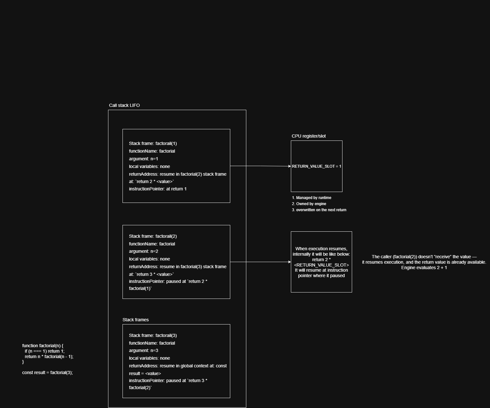
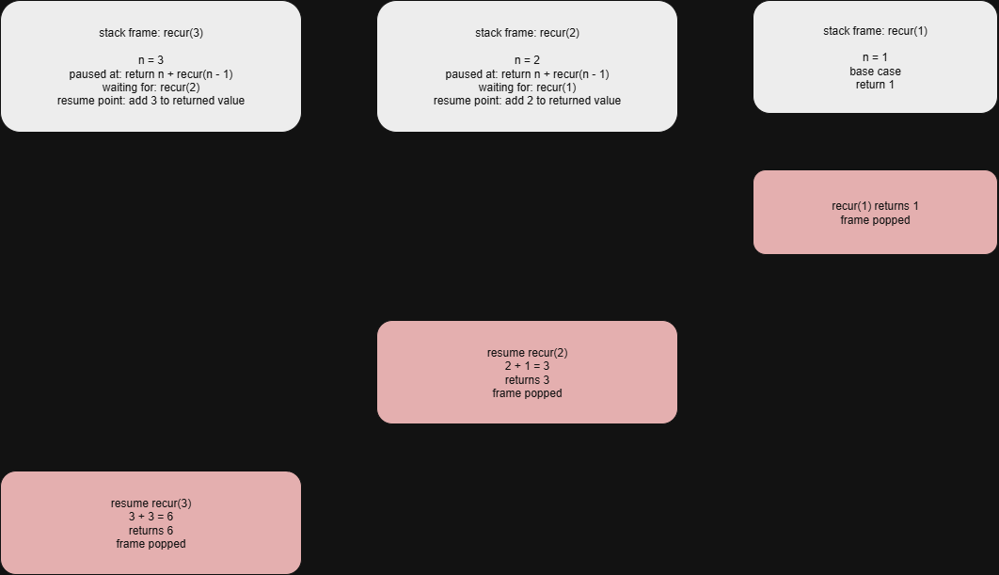
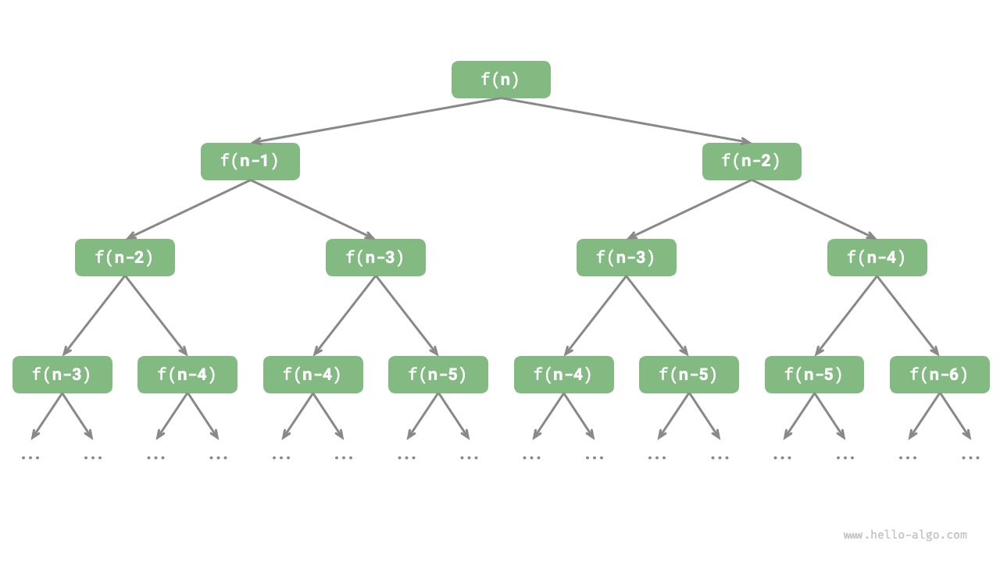

# Recursion

Recursion is an algorithmic strategy that solves problems by having a function call itself. It mainly consists of two phases.

- _Descend:_ The program continuously calls itself deeper, usually passing in smaller or more simplified parameters, until reaching a "termination condition".
- _Ascend:_ After triggering the "termination condition", the program returns layer by layer from the deepest recursive function, aggregating the result of each layer.

From an implementation perspective, recursive code mainly consists of three elements.

- _Termination condition:_ Used to determine when to switch from "descending" to "ascending".
- _Recursive call:_ Corresponds to "descending", where the function calls itself, usually with smaller or more simplified parameters.
- _Return result:_ Corresponds to "ascending", returning the result of the current recursion level to the previous layer.

Fundamentally, recursion embodies the paradigm of "decomposing a problem into smaller subproblems"

## Stack frame

- Everytime a function is called, the computer allocates a block of memory called **stack frame**
- Each stack frame stores everything the function needs to continue later
- The stack frame stores below:
  - Function name
  - **Return address**: A return address is the exact execution point (instruction pointer) where the engine should continue after the current function finishes.
  - **Local variables**: Any data defined inside that specific function call
  - **Parameters**: The inputs passed into the function
  - **Execution position / Instruction pointer**: The execution position (instruction pointer) of a stack frame is where execution is currently paused in that frame and where it should resume when it becomes active again
- Return address → Where to go back to (in the caller)
- Instruction pointer → Where to continue from (inside a frame)



## Standard recursion

```
// Recursive
function recur(n) {
  // Termination condition
  if (n === 1) return 1;
  // Recurse: recursive call - recur(n - 1)
  // Return: return result - n + recur(n - 1)
  return n + recur(n - 1);
}
```



1. When a function is called, its stack frame is pushed onto the top of the call stack. When the function finishes execution, its stack frame is popped off the stack, and control returns to the address specified in the frame. This LIFO (Last-In, First-Out) mechanism is fundamental to managing program execution flow.
2. Each frame in standard recursion has to return something and the returned value is used to do addition operation. So, The current stack frame CANNOT finish until the recursive call returns
3. So the engine must keep the frame alive
4. Each frame stores pending operation (n \* RETURN_VALUE) That pending operation is the killer.
5. **Memory:** High (uses more space as the input grows)
6. **Risk:** Can cause a "Stack Overflow" if the recursion is too deep

## Tail Recursion

```
// Tail recursive
function factTail(n, res) {
  // Termination condition
  if (n === 0) return res;
  // Tail recursive call
  return factTail(n - 1, res + n);
}
```

1. In tail recursion, the recursive call is the last thing the function executes.
2. There is no extra work left to do after the call return (but in standard recursive we have addition work left to do that need to flow back to each stack frame from the termination condition)

```
Call Stack (top → bottom)

┌──────────────────────────┐
│ factTail(1, 24)          │ → returns 24
├──────────────────────────┤
│ factTail(2, 12)          │
├──────────────────────────┤
│ factTail(3, 4)           │
├──────────────────────────┤
│ factTail(4, 1)           │
├──────────────────────────┤
│ Global                   │
└──────────────────────────┘

```

3. Still multiple frames but no pending operations

## Tail Call Optimization (TCO)

Because there is no more work to be done, modern compilers can perform **Tail Call Optimization (TCO)**. Where it uses existing/current stack frame with new values instead of creating a new one.

1. If the JS engine supports TCO (Safari does, Node/Chrome do NOT) it will reuse the current stack frame Instead of pushing a new stack frame.

```
Single Stack Frame Reused

┌──────────────────────────┐
│ factTail(n, acc)         │
│ n: 4 → 3 → 2 → 1         │
│ acc: 1 → 4 → 12 → 24     │
├──────────────────────────┤
│ Global                   │
└──────────────────────────┘
```

2. This works as a while loop as it only uses one stack frame and reuse it
3. **Memory:** Low (uses the same amount of space regardless of input size).
4. **Efficiency:** Much faster and safer for large calculations.
5. Tail Call Optimization (TCO) is not supported in JavaScript engines you actually use today (Node.js, Chrome, V8).
   It exists in the ECMAScript spec, but engines chose not to implement it.

// vishal singh 44638 6126IFAQ-trackapplication

## Recursion Tree

Lets take Fibonacci sequence as example:

```
/* Fibonacci sequence: recursion */
function fib(n) {
    // Termination condition f(1) = 0, f(2) = 1
    if (n === 1 || n === 2) return n - 1;
    // Recursive call f(n) = f(n-1) + f(n-2)
    const res = fib(n - 1) + fib(n - 2);
    // Return result f(n)
    return res;
}
```

1. When dealing with algorithmic problems related to "divide and conquer", recursion often provides a more intuitive approach and more readable code than iteration.
2. Observing the above code, we recursively call two functions within the function, meaning that one call produces two call branches. As shown in Figure 2-6, such continuous recursive calling will eventually produce a recursion tree with
   levels
   
