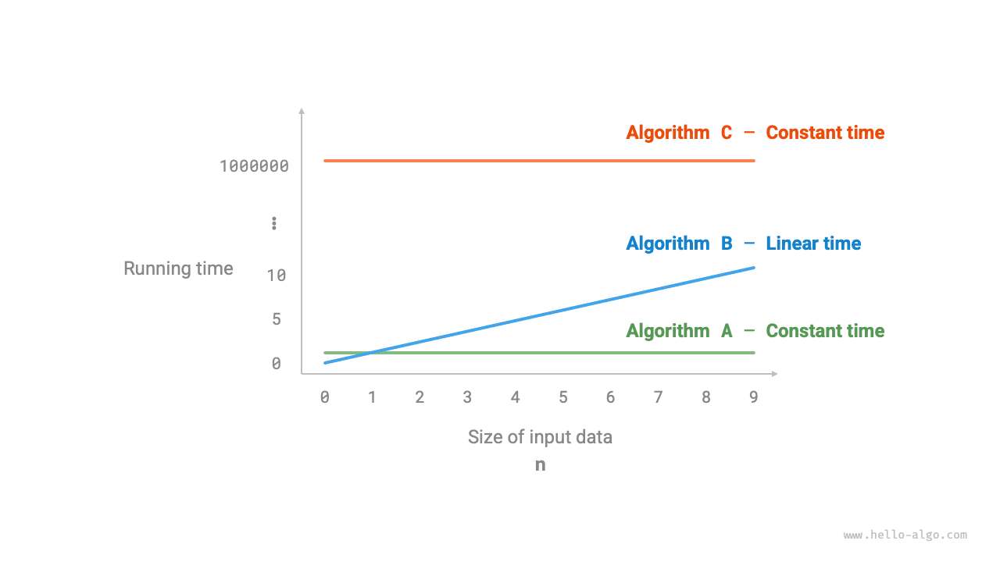
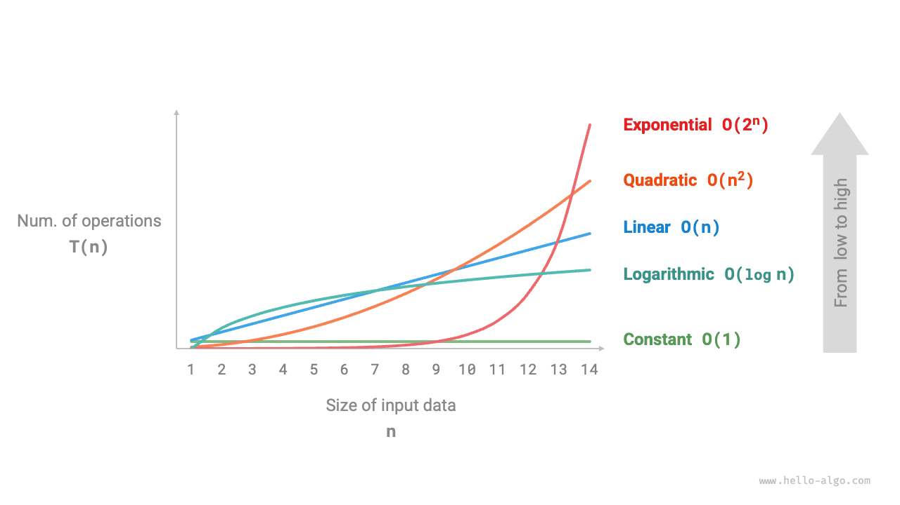
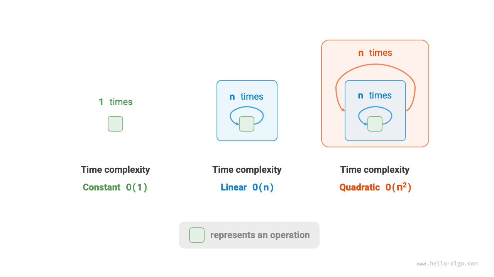
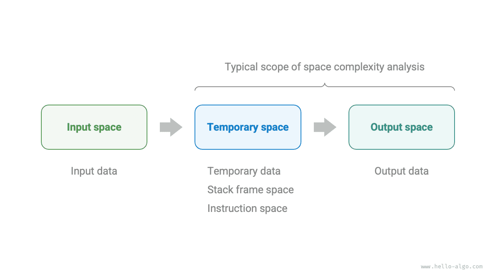
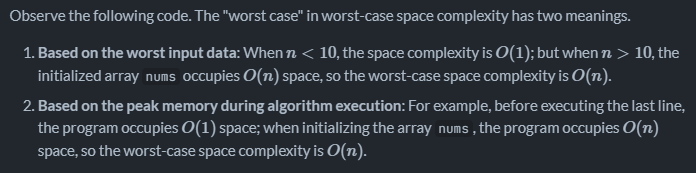
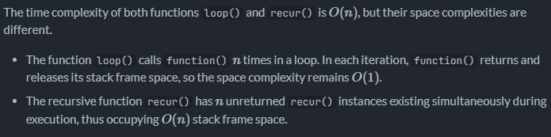
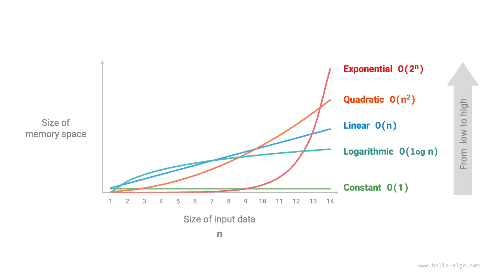
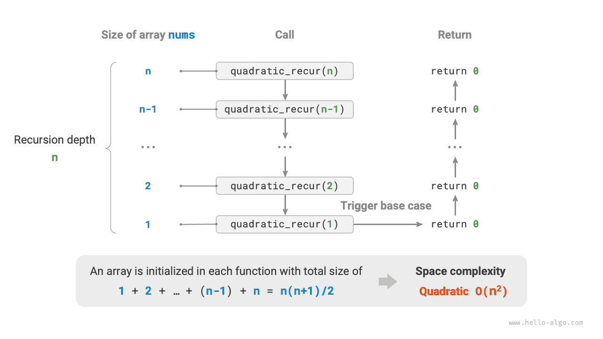

Runtime can reflect the effeciency of an algorithm. If we want to accurately measure the runtime of a piece of code we will have to do below:

1. Determine the running platform - including hardware configuration, programming lang, system environment etc, as these factors all affect code execution efficiency
2. Evaluate the runtime required for various computational operations: for example, addition operation requires 1ns, multiplication requires 10 ns, console.log takes 5ns etc
3. Count all computational operations in the code and sum the execution times of all operations to obtain the runtime

Take below as example:

```
// On a certain running platform
function algorithm(n) {
    var a = 2; // 1 ns
    a = a + 1; // 1 ns
    a = a * 2; // 10 ns
    // Loop n times
    for(let i = 0; i < n; i++) { // 1 ns
        console.log(0); // 5 ns
    }
}
```

According to the above method, the algorithm's runtime is (6n+12)

- In reality, however, counting an algorith's runtime is neither reasonable nor realistic
- As algorithms should be capable of running in different platforms we do not want to tie the estimated time to the running platform
- it is difficult to know the runtime of each type of operation, which brings great difficulty to the estimation process.

# Time Complexity

Time complexity measures the growth trend of an algorithm for the given `n` number of inputs. In simple, it tells us how fast an algorithm's work increase with increase in input size.

- Time complexity helps us answer "will this algorithm work if the data becomes BIG?"
- We will ignore the machine speed, language and seconds - We only care about how the number of operations grow with input size
- Everything in time complexity is described in terms of `n`. **We use Big-O to describe time complexity**

**Example:**

```
// Time complexity of algorithm A: constant order
function algorithm_A(n) {
    console.log(0);
}
// Time complexity of algorithm B: linear order
function algorithm_B(n) {
    for (let i = 0; i < n; i++) {
        console.log(0);
    }
}
// Time complexity of algorithm C: constant order
function algorithm_C(n) {
    for (let i = 0; i < 1000000; i++) {
        console.log(0);
    }
}
```

1. Algorithm A has only 1 print operation and it has nothing to do with the input `n` or its size, so the time complexity is constant order
2. Algorithm B has a loop that depends on size of input `n`. So the more the value of n, the more operations it has to perform (like i++, let i=0, logging etc) the algorithm's runtime grows linearly as `n` increases. So such algorithms has linear order
3. Algorithm C is not dependent on the input `n` so it doesnt matter how much the value of `n` be, it will constantly loop 100000 times. So the time complexity is constant order



**Example 2**

```
function sum(array, n){
    let sum = 0;
    for(let i = 1; i<=n; i++){
        sum = sum + array[i];
    }
    return sum;
}
```

- `sum = 0` is assignment operation and happens only once, so the frequency count of this operation is **1 unit of time**
- `i = 1` is assignment operation and happens only once, so the frequency count of this operation is **1 unit of time**
- `i <= n` is comparision operation:
  - assume n = 3
  - i = 1, 1<=3, 2(because of i++)
  - i = 2, 2<=3, 3(because of i++)
  - i = 3, 3<=3, 4(because of i++)
  - i =4, 4<=3 thats it, it checks but fails. So statement inside for loop will not execute and hence the i++ will also not execute
  - so, considering above, for n=3, `i <= n` comparision operation was executed 4 times, so for `n` number it will execute `n+1` times
- `i++` is arthemetic operation:
  - assume n = 3
  - i = 1, 1<=3, 2(because of i++)
  - i = 2, 2<=3, 3(because of i++)
  - i = 3, 3<=3, 4(because of i++)
  - i =4, 4<=3 thats it, it checks but fails. So statement inside for loop will not execute and hence the i++ will also not execute
  - so, considering above, for n=3, `i++` opeartion was executed 3 times for n = 3, and it would execute 4 times for n = 4, so finally it executes `n` number of times for `n` numbers
- `sum = sum + array[i];` - it has both assignment and arthemetic operations
  - for each loop, we see 2 operations being happened
  - 1 is assignment
  - 1 is addition
  - so for `n` number of loop, it will come to `2n`
- `return sum` will execute only once, so `1`
- Consolidating all above, we get:
  - 1 + 1 + n + 1 + n + 2n + 1 = 4 + 4n
- As 4n in 4n+4 is domianting term, **Big O(n) is the time complexity of this algorithm**

**Limitations**

Consider the Algorithms B & C above, though the algo C is constant order and algo B is linear, imagine if algo B has `n = 10`, in that case, algo C has to loop 100000 times where as algo B has to loop only 10 times. In such cases, it is often difficult to judge the efficiency of algorithms based solely on time complexity. Of course, despite the above issues, complexity analysis remains the most effective and commonly used method for evaluating algorithm efficiency.

## Priori vs Posteriori Analysis

**Priori Analysis**

**Estimation** of time and memory space required by an algorithm **before** executing it on the system

- Estimation of time === Estimation of Total number of CPU computations an algorithm needs to execute
- CPU Computations refers to a task performed by the CPU or instruction executed by the CPU

**Posteriori Analysis**

**Calculation** of time and memory space required by an algorithm **after** executing it on the system

## Asymptotic upper bound of functions

**Asymptotic** -> When the input becomes very large (n -> infinity). We ignore small details like constants or slow-growing parts.

**Upper bound** -> the max limit / worst case growth (no matter what, the algorithm will not grow faster than this). Example: If you tell a friend, "I will be at your house in at most 30 minutes," 30 minutes is your upper bound. You might arrive in 10 or 20 minutes, but you definitely won't take 40.

**Functions** -> a mathematical function that represents work done by the algorithm

1. AUB is a way to describe the maximum growth rate of an algorithm's work when the input size becomes very large
2. Big-O notation( mathematical symbol) is a tool we use to describe an AUP
3. If an algorithm is `O(n)`, then `n` is the AUB. It means, the running time curve will stay below the `n` curve as `n` grows
4. Big-O is about order of growth
5. Order of growth depends on:
   - Highest power of n
   - Not the coefficient

**Key clarifications (very important)**

- Big-O does not measure actual time (seconds, milliseconds)
- Big-O measures how work grows with input size
- We mostly care about large input, not small input
- That’s why Big-O focuses on worst-case, large-scale behavior

**Very very important note:** manam Big O ni only manam rayaboye algorithm ki worst case scenario lo ekkuva data isthe daniyokka growth trend ni munde pasigattataniki use chestham. For example, manam oka function rasthe, manam Big O use chesi aa function time complexity ni describe cheyochu adi ekkuva data unnappudu ela perform chesthadi ani

**Below are some common time complexities arranged in order from low to high**

`constant order < logarthamic order < linear order < linearthmic order < Quadratic order < Exponential order < Factorial order`

`O(1) < O(log n) < O(n) < O(n log n) < O(n^2) < O(2^n) < O(2!)`



## Derivative Method

### 1. Constant order O(1)

The number of operations in constant order is independent of input data size `n`, meaning, it does not change as `n` changes.

```
function doSome(n){
    const x = 1000000;
    let count = 0;
    for(let i=0; i<x; i++){
        count = count + 1;
    }
    return count;
}
```

### 2. Linear order O(n)

The number of operations in linear order is dependent on the input data size `n`. Meaning, it does change as `n` changes. Or in simple, the no. of operations in linear order grows linearly relative to the input data size `n`

```
function doSome(n){
    let count = 0;
    for(let i=0; i<n; i++){
        count = count + 1;
    }
    return count;
}
```

### 3. Quadratic order O(n^2)

The number of operations in Quadratic order increase quadratically relative to the input data size `n`

```
function doSome(n){
    let count = 0;
    for(let i=0; i<n; i++){
        for(let j=0; j<n; j++){
            count = count + 1;
        }
    }
    return count;
}
```



### 4. Exponential order O(2^n)

Exponential order means the amount of work or steps grows extremely fast, doubling with each increase in input size. In other words, if the input is n the total work is proportional to 2^n

```
/* Exponential order (loop implementation) */
function exponential(n) {
  let count = 0,
    base = 1;
  // Cells divide into two every round, forming sequence 1, 2, 4, 8, ..., 2^(n-1)
  for (let i = 0; i < n; i++) {
    for (let j = 0; j < base; j++) {
      count++;
    }
    base *= 2;
    console.log(count, base);
  }
  // count = 1 + 2 + 4 + 8 + .. + 2^(n-1) = 2^n - 1
  return count;
}

/**
 * 1st iteration
 * i = 0
 * j = 0; j < base which is j < 1, which is 0 < 1, which is true
 * count will become 1
 * base will become 2
 *
 * 2nd iteration
 * i = 1
 * j = 0; j < base which is j < 2, which is 0 < 2, which is true
 * count will become 2
 * j = 0; j < base which is j < 2, which is 1 < 2, which is true
 * count will become 3
 * base will become 4
 *
 * 3rd iteration
 * i = 2
 * j = 0; j < base which is j < 4, which is 0 < 4, which is true
 * count will become 4
 * j = 0; j < base which is j < 4, which is 1 < 4, which is true
 * count will become 5
 * j = 0; j < base which is j < 4, which is 2 < 4, which is true
 * count will become 6
 * j = 0; j < base which is j < 4, which is 3 < 4, which is true
 * count will become 7
 * base will become 8
 *
 * Observations
 * base kept doubling on every inner loop completion
 * as base kept doubling, the inner loop kept increasing its loops
 * 1st iteration (i = 0): base = 1 → inner loop runs 1 time
 * 2nd iteration (i = 1): base = 2 → inner loop runs 2 times
 * 3rd iteration (i = 2): base = 4 → inner loop runs 4 times
 * k-th iteration: inner loop runs 2^k-1 times.
 * So the total number of times count++ runs is 1+2+4+8+2^(n-1)
 * the total work done is 2^n - 1, which is O(2^n)
 */

exponential(3);
```

### 5. Logarithamic Order O(log n)

In general, log means: how many times can we divide something until it becomes small enough

example:

log 8 -> you need to divide 8 3 times by 2 -> 8/2 = 4 -> 4/2 = 2 -> 1 -> 3 times. So log 8 of base 2 is 3

| Number | Divide by 2 until 1     | Steps |
| ------ | ----------------------- | ----- |
| 8      | 8 → 4 → 2 → 1           | 3     |
| 16     | 16 → 8 → 4 → 2 → 1      | 4     |
| 32     | 32 → 16 → 8 → 4 → 2 → 1 | 5     |

The question log answers is: **How many times can I divide this thing by 2 until only 1 is left?**

So:

- log(8) ≈ 3
- log(16) ≈ 4
- log(32) ≈ 5

As stated below, Even for a billion items, log is around 30.

That’s why log algorithms are considered extremely efficient.

| Input size (n) | log n | n             |
| -------------- | ----- | ------------- |
| 8              | 3     | 8             |
| 1,000          | ~10   | 1,000         |
| 1,000,000      | ~20   | 1,000,000     |
| 1,000,000,000  | ~30   | 1,000,000,000 |

**Logarithmic time complexity means:**

Each step reduces the problem size by a constant factor (usually half).

This means:

- Input gets large
- Work increases very slowly
- Algorithm scales beautifully

**example**

```
/* Logarithmic order (loop implementation) */
function logarithmic(n) {
    let count = 0;
    while (n > 1) {
        n = n / 2;
        count++;
    }
    return count;
}
```

1. `count = 0` Assignment operation that happen only once, 1 unit of time
2. `while(n > 1)` Comparision operation -> keep going till end
3. `return count` Happens only once, 1 unit of time
4. `count++` incremental operation, 1 unit per iteration
5. `n = n / 2` 2 operations but 1 unit per iteration -> because in time complexity We group constant work into a single unit.
6. `function call` cost 1 unit
7. For the `while(n > 1)`, How many times does the loop iterate ?
   - Assume n = 16
   - Inside the while loop, we are halving the n by 2
   - So we start with n = 16
   - In 1st loop n becomes n = 8
   - In 2nd loop n becomes n = 4
   - In 3rd loop n becomes n = 2
   - In 4th loop n becomes n = 1
   - We check n > 1, 1 > 1, so it fails, so no 5th loop iteration but we do check 1 > 1
   - So, when n = 16, we do 5 comparision operations in total
   - But, Big O does not care about the last 1 comparision operation
   - Because, if the body inside loop runs n times, the condition check runs n+1 times, Big O ignores the constants so we ignore the 1
   - So number of iterations is 4 or we can write it as log(16) or log(n) to the base 2

### 6. Linearithmic Order O(n logn)

An algorithm is linearithmic when it processes every item once, but for each item it also does some logarithmic work

**example:**

```
/* Linearithmic order */
function linearLogRecur(n) {
    if (n <= 1) return 1;
    let count = linearLogRecur(n / 2) + linearLogRecur(n / 2);
    for (let i = 0; i < n; i++) {
        count++;
    }
    return count;
}
```

| Step | Action               | Call Stack (TOP → BOTTOM)                                                             | Notes                 |
| ---- | -------------------- | ------------------------------------------------------------------------------------- | --------------------- |
| 1    | Call function        | `linearLogRecur(8)`                                                                   | Program starts        |
| 2    | Check base case      | `linearLogRecur(8)`                                                                   | `8 <= 1` ❌           |
| 3    | Call left recursion  | `linearLogRecur(4)` → `linearLogRecur(8)`                                             | Parent pauses         |
| 4    | Check base case      | `linearLogRecur(4)` → `linearLogRecur(8)`                                             | `4 <= 1` ❌           |
| 5    | Call left recursion  | `linearLogRecur(2)` → `linearLogRecur(4)` → `linearLogRecur(8)`                       | Stack grows           |
| 6    | Check base case      | `linearLogRecur(2)` → `linearLogRecur(4)` → `linearLogRecur(8)`                       | `2 <= 1` ❌           |
| 7    | Call left recursion  | `linearLogRecur(1)` → `linearLogRecur(2)` → `linearLogRecur(4)` → `linearLogRecur(8)` | Stack grows           |
| 8    | Base case hit        | `linearLogRecur(1)` → ...                                                             | Returns `1`           |
| 9    | Resume parent        | `linearLogRecur(2)` → `linearLogRecur(4)` → `linearLogRecur(8)`                       | Left done             |
| 10   | Call right recursion | `linearLogRecur(1)` → `linearLogRecur(2)` → `linearLogRecur(4)` → `linearLogRecur(8)` | Same process          |
| 11   | Base case hit        | `linearLogRecur(1)` → ...                                                             | Returns `1`           |
| 12   | Compute count        | `linearLogRecur(2)` → `linearLogRecur(4)` → `linearLogRecur(8)`                       | `1 + 1 = 2`           |
| 13   | Loop runs            | `linearLogRecur(2)` → ...                                                             | Loop runs **2 times** |
| 14   | Return               | `linearLogRecur(4)` → `linearLogRecur(8)`                                             | Returns `4`           |
| 15   | Call right recursion | `linearLogRecur(2)` → `linearLogRecur(4)` → `linearLogRecur(8)`                       | No memoization        |
| 16   | Full repeat          | `linearLogRecur(2)` → ...                                                             | Returns `4`           |
| 17   | Compute count        | `linearLogRecur(4)` → `linearLogRecur(8)`                                             | `4 + 4 = 8`           |
| 18   | Loop runs            | `linearLogRecur(4)` → ...                                                             | Loop runs **4 times** |
| 19   | Return               | `linearLogRecur(8)`                                                                   | Returns `12`          |
| 20   | Call right recursion | `linearLogRecur(4)` → `linearLogRecur(8)`                                             | Second branch         |
| 21   | Full repeat          | `linearLogRecur(4)` → ...                                                             | Returns `12`          |
| 22   | Compute count        | `linearLogRecur(8)`                                                                   | `12 + 12 = 24`        |
| 23   | Loop runs            | `linearLogRecur(8)`                                                                   | Loop runs **8 times** |
| 24   | Final return         | _(empty)_                                                                             | Returns **32**        |

**How is it O(n logn) ?**

Below is the call structure at high level

```
                                fn(8)
                    /                           \
                   /                             \
                  /                               \
                fn(4)                           fn(4)
          /              \                /              \
        fn(2)           fn(2)           fn(2)           fn(2)
      /     \         /      \        /       \       /       \
   fn(1)   fn(1)    fn(1)   fn(1)   fn(1)   fn(1)   fn(1)   fn(1)
```

As seen above, the number of calls made to `fn` function at each level is:

- level 1 fn(8) 1
- level 2 fn(4) 2
- level 3 fn(2) 4
- level 4 fn(1) 8

Lets count loop size per call

- at fn(8), n = 8 and for loop will loop 8 times
- at fn(4), n = 4 and for loop will loop 4 times
- at fn(2), n = 2 and for loop will loop 2 times
- at fn(1), n = 1 and for loop will not loop as we return 1 when n = 1

Tried my best but couldnt understand how to conclude it is nlogn

https://chatgpt.com/share/6977018b-5dc4-800e-8037-dd34c8ceb05b

https://www.hello-algo.com/en/chapter_computational_complexity/time_complexity/#6-linearithmic-order-on-log-n

### 7. Factorial Order O(n!) - yet to understand

## QA's

Consider `n²` & `100n²`

_Q. How does 100 in `100n²` affect the time complexity compared to `n²`?_\
A:

```
If n = 10
3n² = 3 x 100 = 300 (Number of operations is 300)
300n² = 300 x 100 = 30,000 (Number of operations is 30,000)

Clearly 300n² is doing more work
```

But, In Asymptotic Analysis (Big-O), we only care about Scalability, we only care about **HOW** that number explodes when the input size increases. How the growth pattern is but not the number of operations.

```
Assume n² increases 10 times
3n² => 3 x (10 x n²) = 3 x (10 X 100) = 3000
300n² => 300 x (10 x n²) = 300 x (10 x 100) = 300000

Growth pattern is that both has grown linearly. Both grown 100 times longer than it did before (100 times because before it was 3 x (10 x 10) now it is 3 x (10 x 100))

Both react to data growth in the exact same way
```

_Q. Why do we ignore the constants like 100 ?_

A:

We ignore constants because they do not change how fast an algorithm grows when input size becomes very large

```
Algo - A

for (let i = 0; i < n; i++) {
  doSomething();
}

Opertions = n
Time complexity = f(n) = n

Algo - B

for (let i = 0; i < 5*n; i++) {
  doSomething();
}

Opertions = 5n
Time complexity = f(n) = 5n
```

Is algo B worse ? -> In terms of small input, yes

```
Algo A -> n = 10 -> 10 operations
Algo B -> n = 10 -> 50 opeartions
```

But when input size is large ?

```
Algo A -> n = 1000 -> 1000 operations
Algo B -> n = 1000 -> 5000 operations
```

**One is just 5× slower, but the growth pattern is identical.**

So, `O(n) == O(5n)`

**Examples**

`f(n) = 3n² + 10n + 500`

1. As `n` becomes very large, 10n becomes insigniicant, 500 becomes irrelevent
2. So we say `Asymptotic Upper Bound = O(n²)`
3. Because `n²` dominates everything else for large `n`

## Definetions

### Runtime

Runtime is the phase when a computer program is actively executing instructions, from when you launch it until you close it, involving CPU, memory, and I/O

# Space Complexity

Space complexity measures the growth trend of memory space occupied by an algorithm as the data size increases.

The memory space used by an algorithm during execution mainly includes the following types:

1. **Input space:** Used to store the input data of the algorithm
2. **Temporary space:** Used to store variables, objects, function context and other data during the algorithm execution. This can be further divided into three parts:
   - **Temporary data:** Used to save constants, variables, objects etc
   - **Stack frames:** Used to save the context data of called functions. The system creates a stack frame at the top of the stack each time a function is called, and the stack frame space is released after the function returns.
   - **Instruction space:** Used to save compiled program instructions, which are usually ignored in actual statistics
3. **Output space:** Used to store the output of the algorithm

**_Note: In general, the scope of space complexity statistics is "temporary space" plus "output space"._**

When analyzing the space complexity of a program, we usually count three parts: temporary data, stack frame space, and output data, as shown in the following figure.



Related code is as follows:

```
/* Class */
class Node {
    val;
    next;
    constructor(val) {
        this.val = val === undefined ? 0 : val; // Node value
        this.next = null;                       // Reference to the next node
    }
}

/* Function */
function constFunc() {
    // Perform some operations
    return 0;
}

function algorithm(n) {       // Input data
    const a = 0;              // Temporary data (constant)
    let b = 0;                // Temporary data (variable)
    const node = new Node(0); // Temporary data (object)
    const c = constFunc();    // Stack frame space (function call)
    return a + b + c;         // Output data
}
```

## Calculation method

The calculation method for space complexity is roughly the same as for time complexity, except that the statistical object is changed from "number of operations" to "size of space used".

Unlike time complexity, we usually only focus on the worst-case space complexity. This is because memory space is a hard requirement, and we must ensure that sufficient memory space is reserved for all input data.

Consider below example:

```
function algorithm(n) {
    const a = 0;                   // O(1)
    const b = new Array(10000);    // O(1)
    if (n > 10) {
        const nums = new Array(n); // O(n)
    }
}
```



In recursive functions, it is necessary to count the stack frame space. Observe the following code:

```
function constFunc() {
    // Perform some operations
    return 0;
}
/* Loop has space complexity of O(1) */
function loop(n) {
    for (let i = 0; i < n; i++) {
        constFunc();
    }
}
/* Recursion has space complexity of O(n) */
function recur(n) {
    if (n === 1) return;
    return recur(n - 1);
}
```



## Common types

Let the input data size be
. The following figure shows common types of space complexity (arranged from low to high).



### Constant Order O(1)

Constant order is common in constants, variables, and objects whose quantity is independent of the input data size `n`.

It should be noted that memory occupied by initializing variables or calling functions in a loop is released when entering the next iteration, so it does not accumulate space, and the space complexity remains `O(1)`

```
/* Function */
function constFunc() {
    // Perform some operations
    return 0;
}

/* Constant order */
function constant(n) {
    // Constants, variables, objects occupy O(1) space
    const a = 0;
    const b = 0;
    const nums = new Array(10000);
    const node = new ListNode(0);
    // Variables in the loop occupy O(1) space
    for (let i = 0; i < n; i++) {
        const c = 0;
    }
    // Functions in the loop occupy O(1) space
    for (let i = 0; i < n; i++) {
        constFunc();
    }
}
```

### Linear Order O(n)

Linear order is common in arrays, linked lists, stacks, queues, etc., where the number of elements is proportional to `n`

```
/* Linear order */
function linear(n) {
    // Array of length n uses O(n) space
    const nums = new Array(n);
    // A list of length n occupies O(n) space
    const nodes = [];
    for (let i = 0; i < n; i++) {
        nodes.push(new ListNode(i));
    }
    // A hash table of length n occupies O(n) space
    const map = new Map();
    for (let i = 0; i < n; i++) {
        map.set(i, i.toString());
    }
}
```

As shown in the following figure, the recursion depth of this function is `n`meaning that there are `n` unreturned `linear_recur()` functions existing simultaneously, using O(n) stack frame space:

```
/* Linear order (recursive implementation) */
function linearRecur(n) {
    console.log(`Recursion n = ${n}`);
    if (n === 1) return;
    linearRecur(n - 1);
}
```

### Quadratic Order O(n^2)

Quadratic order is common in matrices and graphs, where the number of elements is quadratically related to `n`

**Quadratic space only happens when EACH level allocates memory proportional to n**

1️⃣ Does recursion depth grow with n?
→ affects stack space

2️⃣ Does each level allocate memory that grows with n?
→ affects heap space

Only when both grow → 🚨 quadratic danger

So in below example, Both stack and heap memory grows as `n` grows so it is O(n^2)

```
/* Quadratic order (recursive implementation) */
function quadraticRecur(n) {
    if (n <= 0) return 0;
    const nums = new Array(n);
    console.log(`In recursion n = ${n}, nums length = ${nums.length}`);
    return quadraticRecur(n - 1);
}
```



### Exponential Order O(2^n)

Each step multiplies the work instead of just adding.

🚨 The moment you see TWO recursive calls, your brain should scream: “⚠️ Possible exponential!”

```
Linear:

1 → 2 → 3 → 4

Exponential:

1 → 2 → 4 → 8 → 16
```

Consider below example:

```
function buildTree(n) {
    if (n === 0) return null;
    const root = new TreeNode(0);
    root.left = buildTree(n - 1);
    root.right = buildTree(n - 1);
    return root;
}

buildTree(4)
```

**At level 0 (root)**

`buildTree(4)`

- Creates 1 node
- calls buildTree(3) twice

**At level 1**

```
            buildTree(4)
              /      \
     buildTree(3)   buildTree(3)
```

- Created 2 nodes
- Total nodes created is 2 + 1

**At level 2**

Each buildTree(3) again calls two buildTree(2):

```
                    buildTree(4)
                   /            \
           buildTree(3)        buildTree(3)
            /      \            /      \
   buildTree(2) buildTree(2) buildTree(2) buildTree(2)
```

- Created 4 nodes
- Total nodes created is 4 + 2 + 1

**At level 3**

Each buildTree(2) creates two buildTree(1):

- Creates 8 nodes of buildTree(1)
- Total nodes created 8 + 4 + 2 + 1

**At level 4**

Each buildTree(1) creates two buildTree(0):

- Creates 16 nodes of buildTree(0)
- Total nodes created 16 + 8 + 4 + 2 + 1

**Stops recursion**

**Count how many calls happen**
| Level | Calls |
| ----- | ----- |
| 0 | 1 |
| 1 | 2 |
| 2 | 4 |
| 3 | 8 |
| 4 | 16 |

Notice the pattern? Calls double every level **That’s exponential growth.**

As each level doubles the number of recursive calls, leading to exponential growth. the time complexity is exponential O(2^n)

The same way, as each level doubles the number of recursive calls, the `const root = new TreeNode(0);` part is also called exponentially at each level, so the space complexity is also O(2^n)

**Mental check list**

When you see recursion, ask:

1️⃣ How many recursive calls per function?

1 → linear

2 → exponential ⚠️

2️⃣ Does each call allocate memory?

yes → heap growth

3️⃣ What’s max depth?

stack growth

### Logarithmic Order O(log n) - need indepth

Logarithmic order is common in divide-and-conquer algorithms. For example, merge sort: given an input array of length `n`, each recursion divides the array in half from the midpoint, forming a recursion tree of height `log n`, using `O(log n)`stack frame space.
