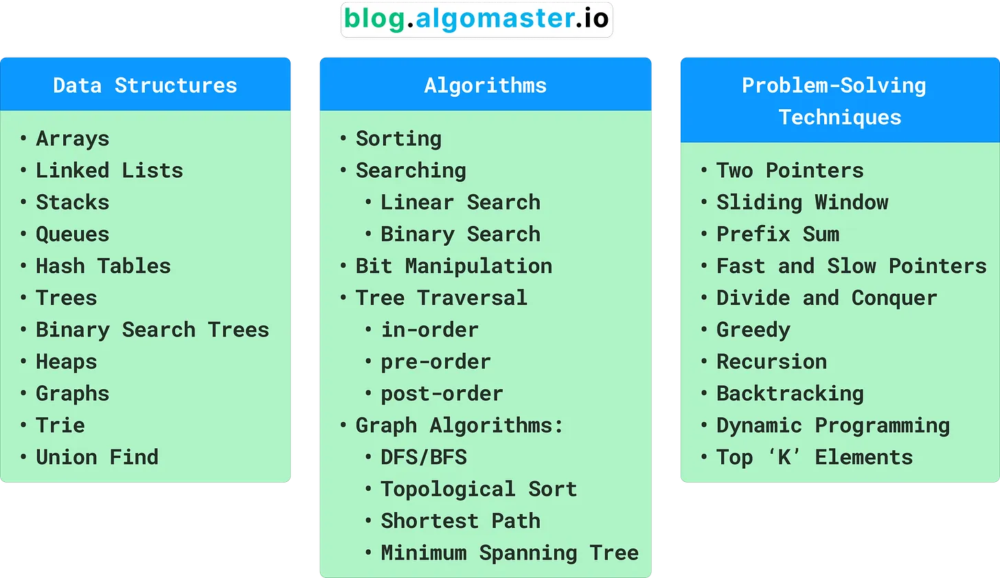
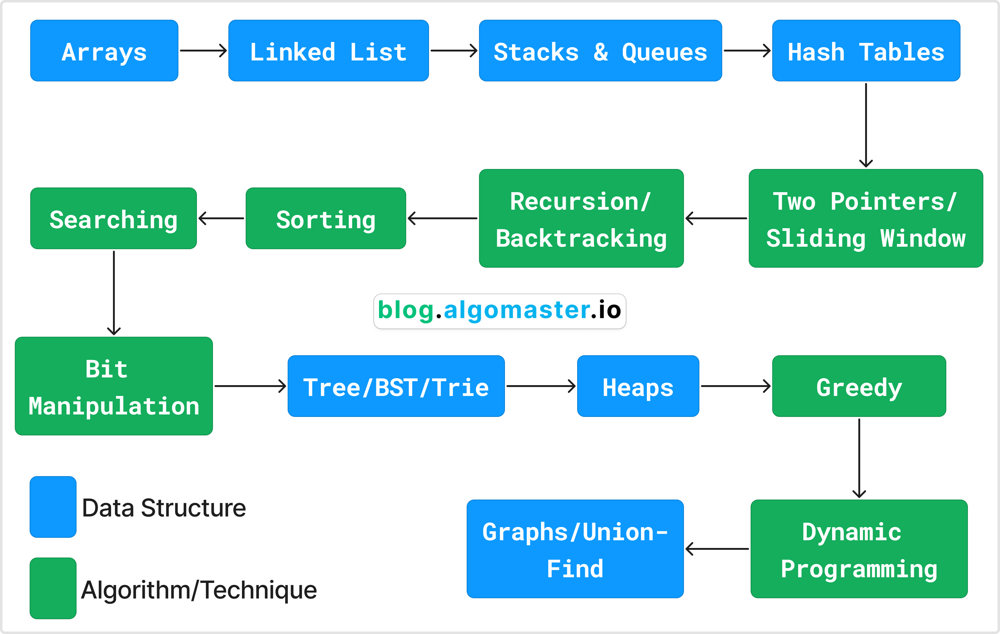

# Important Points

1. Focusing on one topic at a time makes the learning process more manageable
2. Here is an order you can follow:

 3. Way to start learning: - Learn what it is - How it is represented in code - Different operations you can perform on it - Their time and space complexities
