# Intro

1. A distributed system is a system whose components are located on different networked computers which communicate and coordinate their actions by passing messages to one other or A distributed system means Many computers (machines) working together over a network to act like one system (example: Uber app, whatsapp, Amazon, Google drive etc)
2. The components of this system can be thought of as software programs that run on a physical hardware such as computers.
3. These components take many forms like web servers, routers, browsers etc

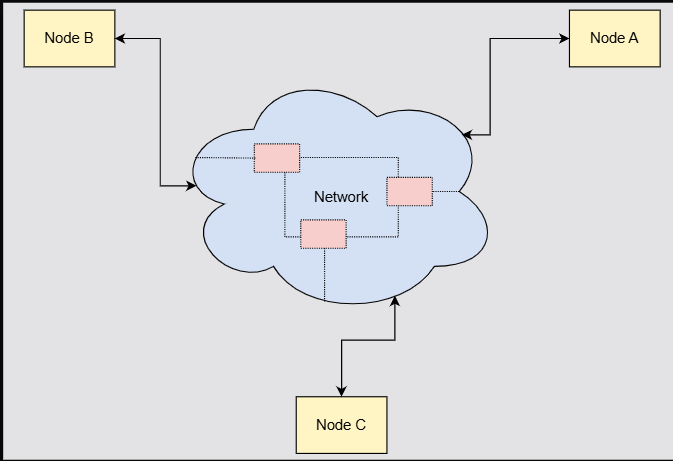

The above illustration shows that the network either consists of direct connections between the distributed system components, or more components that form the backbone of the network (e.g., if communication is done through the Internet).

# Parts of distributed systems

1. The components or multiple independent parts (services) that are running on different machines
2. The network that connects them - It acts as a communication mechanism that lets them exchange messages (which is slow, unreliable and failure prone)

# Benefits

1. Performance
2. Scalability
3. Availability

## Performance

It measures how quickly and efficiently a software system reponds to requests or completes tasks. It includes metrics like latency(delay per request) and throughput(number of tasks handle per time unit)

## Scalability

It is the capability of a system, network or process to handle a growing amount of work or its potential to be enlarged to accommodate that growth

## Availability

It means how often the software system is up and working properly when people need it. For example, a system with high availability is almost always online and ready to use with very little downtime

# Fallacies of Distributed Computing

Fallacies are the false beliefs engineers make when building systems that run on multiple machines connected by network

## Fallacies

There are 8 such fallacies of distributed computing:

1. The network is reliable
2. The network is homogeneous
3. The network is secure
4. There is only one administrator
5. Topology never change
6. Latency is 0
7. Bandwidth is infinite
8. Transport cost is 0

### 1. The network is reliable

**Wrong belief**: Network always work\
**Reality**: Network can fail, packets can be lost, connections can drop anytime\
**Examples**: You send a request from A to B `A ------ request -------> B`\
**What if**: Cable is unplugged ? Router is crashed ? Firewall blocked ? Now A is waiting forever

### 2. The network is homogeneous

**Wrong belief**: All machines are same\
**Reality**: Different OS, hardware, languages etc\
**Examples**: Java service sends null to JS service and it crashes because its not the same service to expect that.

### 3. The network is secure

**Wrong belief**: Internal network is safe\
**Reality**:Internal networks get hacked, data can be intercepted\
**Examples**: microservice talk to DB without Auth. Attacker inside that network can have full access

### 4. There is only one administrator

**Wrong belief**: One team controls everything\
**Reality**: Multiple teams, Different priorities, Different configurations\
**Examples**: Your service expects JSON, other service sends XML

### 5. Latency is zero

**Wrong belief**: Network calls are instant\
**Reality**: Network calls are slow compared to in-memory or CPU\
**Examples**: In-memory call: nanoseconds where as Network call: milliseconds

```
A → (10ms) → B → (15ms) → C → (20ms) → DB
Total = 45ms
```

### 6. Bandwidth is infinite

**Wrong belief**: Can send unlimited data\
**Reality**: Bandwidth is limited & Big payloads = slow + expensive\
**Examples**: 5MB JSON response ❌ Instead of sending only needed fields ✅

### 7. Transport cost is zero

**Wrong belief**: Network calls are cheap\
**Reality**: Network = CPU + memory + money and Cloud providers charge for data transfer\
**Examples**: Frequent DB calls over network instead of caching.

### 8. Topology never changes

**Wrong belief**: Machines never change\
**Reality**: Servers die, IPs change, Containers restart etc\
**Examples**: You hard code IP from a service to another service, and that service restarts and the ip changes.

# Why distributed systems are hard to design ?

No matter how carefully we design distributed systems, uncontrollable factors like network failures are always a challenge. It’s worth adding that these issues stem from the inherent nature of distributed systems, where network unpredictability, partial failures, and concurrency make perfect reliability nearly impossible. Additionally, handling partial failures requires strategies like retries, timeouts, and consensus algorithms to maintain consistency and availability. Keep exploring these fascinating challenges!

# Properties that make distributed systems challenging

## Network asynchrony

Machines talk to eachother using a network(internet, LAN). But network can be slow, can fail, packets can be lost, messages can arrive late or out of order

**Example**:

You send a WhatsApp message:

- You tap Send
- It shows one tick
- After some time → two ticks

❓ What happened?

- Message reached WhatsApp server

- Network delay between your phone and server

- Receiver’s phone maybe offline

**Why this is challenging**

Your system never knows for sure:

- Did the message reach?

- Or is it just slow?

- Or did it fail completely?

## Partial failures

1. Partial failures occur when only some parts or components of a distributed system fail.
2. But in single-server apps it assumes either full operation or total crash has occured
3. This makes ensuring atomicity - meaning, apply any operations you want to apply, to entire all components or not at all

In simple, in distributed systems, one service can fail and other services keep working - this is what it means when we say partial failures

**example**:

Uber system:

- Payment service ❌ down
- Ride matching service ✅ working
- Map service ✅ working

Now what?

- Ride booked
- But payment failed

**Why this is challenging**

You must handle:

- Retries
- Rollbacks
- Compensation logic

`Ride booked → Payment failed → Cancel ride automatically
`

## Concurrency

1. Concurrency is running multiple computations simultaneously, possibly on same data (that might be a shared data), causing them to interleave
2. This adds complexity due to potential interference & unexpected behaviour unlike simple programs that execute commands sequentially as written

In simple, many users do things at the same time

**Example**:

- 100 users booking the last movie ticket
- Only 1 seat available

**Why this is challenging**

You must prevent:

- Double booking
- Race conditions

**Solutions:**

- Locks
- Transactions
- Idempotency

## No Global Clock

1. It means that each machine has its own clock
2. Clocks do drift and are not perfectly synced

**Why this is challenging**

- Ordering events is hard
- Versioning data is hard
- Conflict resolution is hard

**This is why systems use:**

- Logical clocks
- Vector clocks
- Timestamps with care

## Data consistency is hard

It means that same data exists in multiple machines

**Example:**

Bank balance replicated in 2 servers:

- Server A: ₹10,000
- Server B: ₹10,000

Two withdrawals at same time:

- ₹6,000 from A
- ₹6,000 from B

Final balance ❓
👉 -₹2,000 (wrong!)

**Why this is challenging**

You must choose:

- Strong consistency (slow)
- Eventual consistency (complex)
- This leads to CAP theorem later.

## Scalability

Scalability is a system's ability to handle increased demand or growth effectively without compromisig performance, quality or stability.

Your system must:

- Handle 100 users today
- Handle 10 million users tomorrow

**Why this is challenging**

You must:

- Add machines easily
- Load balance traffic
- Avoid single point of failure

## Security & trust

Machines communicate over networks → can be attacked

**Example**

- Fake service pretending to be real
- Data sniffing
- Replay attacks

**Why this is challenging**

You must handle:

- Authentication
- Authorization
- Encryption
- Secure communication

## Complexity explosion

The more machines the more failure combinations

**Example:**

With 1 machine:

- 1 failure case

With 10 machines:

- Thousands of combinations

**Why this is challenging**

- Hard to debug
- Hard to test
- Hard to reproduce bugs

<!-- 1. Can we call "Network is Unreliable" as "Network Asynchrony" ?
2. In the first section, you mentioned in why it is challenging "Did the message reach" - but we know it reached because it shows double tick right ? Also for "did it fail completely" when it shows double tick, it will never mean that it failed right ?
3. Assume there are two express servers running in a laptop that talk to eachother or a react server talking to express, is this still called as distributed system ?
4. Can you give a practical example for concurrency in JS ? I detail and step by step
5. I did not understand the example you gave in No Global Clock, can you give s step by step detail example
6. How 1 failure case in 1 machine can create thousands of combinations ?
 -->

# Measures of correctness in distributed systems

## Correctness

- Correctness means: the system behaves the way it is expected to behave even when many machines are involved, network is slow or failing, many users act at the same time. If the system gives wrong result, it is incorrect, even if it is fast.
- We can define the correctness of a system in terms of properties it must satisfy

**Example:**\
You have ₹10,000 in your bank.

You withdraw ₹5,000

Correct behavior:

- Cash given = ₹5,000
- Balance becomes = ₹5,000

If:

- Cash given = ₹5,000
- Balance becomes = ₹2,000 ❌

System is NOT correct, even if ATM was fast.

## Why Correctness is Hard in Distributed Systems?

Because:

- Many machines
- Network delays
- Partial failures
- Concurrent requests

**Example:**

- Two devices withdrawing money at same time
- Two users booking last ticket
- Two services updating same data

## It is measured using two properties

### Safety (nothing bad happens)

1. Safety property defines something that must never happen in a correct system
2. Or we can say that the system should never do something wrong, even ONCE is not allowed

**Example:**

`Rule: Account balance should never go negative`

If balance = 3000
Withdraw request = 5000

Correct behaviour is to reject that transaction

If system allows, balance will become -2000

Safety is violated

### Liveness (something good eventually happens)

1. Liveness property defines something that must eventually happen in a correct system
2. or we can say that the system should not get stuck forever

**Example:**

You send a message on whatsapp > Network is slow or receiver is offline

correct behavious is the message to be delivered eventually

Incorrect behaviour is message is never delivered or app keeps spinning forever

## More such properties

### Consistency (Same view of data)

All users see correct and expected data

**Example:**

Post has 100 likes.

User A likes → becomes 101

User B refreshes → sees 80 ❌

System is inconsistent.

**Why it happens**

- Data replicated
- Updates not synced yet

### Linearizability (Strong correctness)

Operations look like they happened one after another, in real-time order

**Example: Google Docs**

- You type "Hello"
- Friend types "World"

Correct -> Hello World
Incorrect -> Hlelo Wrold

System must respect real-time order.

### Sequential Consistency (weaker than linerizability)

All machines agree on the same order, but not necessarilty real-time order

**Example**

Machine A does:

```
Write X = 1
Write X = 2
```

All machines must see:

`X = 1 -> X = 2`

But exact timing doesnt matter

### Eventual consistency (Most used in real system)

System maybe inconsistent temporarily, but becomes correct eventually

**Example: Amazon cart**

- You add item
- Another device doesn’t show immediately
- After few seconds → shows correctly

This is acceptable.

## Simple Comparison Table

| Measure                | Meaning                | Example             |
| ---------------------- | ---------------------- | ------------------- |
| Safety                 | Nothing bad happens    | No negative balance |
| Liveness               | Something good happens | Message delivered   |
| Consistency            | Same data view         | Same like count     |
| Linearizability        | Real-time order        | Google Docs         |
| Sequential Consistency | Same order             | Memory writes       |
| Eventual Consistency   | Correct later          | Shopping cart       |

## Same order vs Real time order

| Aspect               | Same Order             | Real-time Order |
| -------------------- | ---------------------- | --------------- |
| Agreement            | All nodes agree        | All nodes agree |
| Respects clock time? | ❌ No                  | ✅ Yes          |
| Stronger?            | ❌ Weaker              | ✅ Stronger     |
| Name                 | Sequential Consistency | Linearizability |
| Used where?          | Caches, memory models  | Payments, locks |

**Example:**

Lets take whatsapp group as example

_Same order:_

All users see

```
Message B
Message A
```

Even if A was sent first -- it is still ok as long as everyone see the same order

_Real time order_

If A was sent first in real life, Message A should appear first and then Message B. Must be preserved

**When REAL-TIME ORDER is REQUIRED**

- Bank transactions
- Locks
- Inventory count
- Seat booking

👉 Wrong order = money loss ❌

**When SAME ORDER is ENOUGH**

- Caches
- Analytics
- Logs
- Recommendations

👉 Faster + scalable ✅

**Interview questions**

_Q. What is the difference between same order and real-time order?_

A:\
In same order, all nodes agree upon one operation order\
where as in real time order all nodes agree upon one operation order and also ensures that the order matches actual execution time\
or\
In same order (sequential consistency), all nodes agree on a single order of operations, but this order does not need to match real-time execution.\
In real-time order (linearizability), all nodes agree on a single order of operations and this order must match the actual real-world execution time.

_Q. Which is stronger: sequential consistency or linearizability?_

A:\
Linearizability is stronger because it respects real-time ordering

_Q. Can a system be sequentially consistent but not linearizable?_

A:\
Yes, if all nodes agree on the same order but that order violates real-time execution

_Q. Which consistency do database usually relax?_

A:\
They often relax real-time ordering to improve performance and availability. Relax means: deliberately NOT strictly enforcing a rule

**Strict real-time order (NOT relaxed)**

Imagine:

Every write must:

- Contact all servers
- Confirm exact ordering
- Wait for slowest server

Result:

- Slow ❌
- Less available ❌
- Strong correctness ✅

This is linearizability.

**Relaxed real-time order (Relaxed)**

Now imagine:

- Writes go to nearest server
- Other servers update later
- Temporary inconsistency allowed

Result:

- Fast ✅
- Highly available ✅
- Small temporary inconsistency ❌ (but acceptable)

This is eventual consistency / sequential consistency.

**Strict rule (not relaxed)**

Bank transfer:

- Must be correct immediately
- Cannot be wrong even for 1 second

👉 Do NOT relax

**Relaxed rule**

Instagram likes:

- You like a post
- Count updates slowly

👉 Relaxing real-time order is OK

**Why relaxing improves performance 🚀**

Because system:

- Doesn’t wait for all nodes
- Reduces network calls
- Avoids global coordination

**Why relaxing improves availability 🟢**

Because system:

- Works even if some nodes are down
- Doesn’t block waiting for slow nodes

# System models

We can define a system model as a simplified description of how a distributed system works.

Real-life distributed systems vary widely due to factors like network and hardware differences. Therefore, a common framework is needed to address problems generically, avoiding repetitive reasoning for each system variation.

It answers questions like:

- How many machines are there?
- How do they communicate?
- What can go wrong?
- What assumptions are we making?

**Example 1**

Certainly! Imagine a distributed system like a global online shopping platform. It runs on different servers worldwide (different hardware) and uses various internet connections (different networks). Despite these differences, the platform must ensure customers get consistent service everywhere. By using a common system model, developers can design algorithms that work correctly regardless of the specific hardware or network conditions. This avoids creating separate solutions for each server or network type, simplifying development and ensuring reliability across the system.

## Why system models are important ?

System models help us:

- Design correct systems
- Predict failures
- Compare solutions

## Making a generic model

To create a model of a distributed system, we should define several properties it must satisfy. If we prove an algorithm is correct for this model, then we can be sure that it will also be correct for all other systems that satisfy these properties (meaning, we can use this generic model for all the systems that satify these properties)

## Properties each system follows

The main important properties in a distributed system concern the following:

- How the nodes of a distributed system interact with each other
- How the nodes of a distributed system can fail

## Types

There are 3 main types in system model

### 1. Physical System Model

This talks about what is physically present like How many machines ? Where are they located ? How are the connected ?

**Example:**

- 3 backend servers
- 1 database server
- Connected via internet

```
Client
   |
Internet
   |
[ Server 1 ]   [ Server 2 ]   [ Server 3 ]
        \        |        /
             [ Database ]

```

**Real-life example**

Uber system:

- Mobile app (client)
- Backend servers in multiple regions
- Databases in data centers

**📌 Physical model = Hardware + Network**

### 2. Architectural System Model

This explains how components are organized

**Common architectures you must know**

**A. Client-Server Model**

`client -> server -> database`

example: browser -> nodejs server -> mongodb

used in simple web apps

**B. 3 tier architecture**

`Client (UI) -> Application Layer (Business logic) -> Database`

example: React -> NestJs -> PostgreSQL

used in Enterprise apps (ServiceNow, Microsoft)

**Difference between A and B**

| Question            | Client–Server | 3-Tier |
| ------------------- | ------------- | ------ |
| Can logic be mixed? | Yes           | No     |
| Enforced structure? | No            | Yes    |
| Testability         | Poor          | Good   |
| Enterprise ready    | ❌            | ✅     |

**example:**

If we mix up everything in one file that could have been separated or in modular way, then it is client-server (like below)

```
Express Example ❌ (Client–Server style)

app.get("/orders", async (req, res) => {
  const orders = await Order.find();
  res.json(orders);
});

Here:

Business logic ❌
DB logic ❌
API handling ❌
→ All mixed
```

If we maintain modular way of things which can be shared accross the server, it is 3 tier

```
Express Example ✅ (3-Tier style)

routes → controllers → services → repositories → db

// controller
getOrders(req, res) {
  return orderService.getOrders();
}

// service
getOrders() {
  return orderRepo.fetchOrders();
}

📌 Same Express, but now it is 3-Tier
```

**C. Microservices Architecture**

```
User Service
Order Service
Payment Service
(all independent)
```

Example:

- Uber uses microservices
- Each service scales independently

📌 Architectural model = Software structure

### 3. Fundamental System Model

This model talks about assumptions and guarantees and it has 3 sub models

#### **1. Interaction Model**

Talks about time & communication

**Types:**

- Synchronous system

- Asynchronous system

```
Synchronous: message arrives in fixed time
Asynchronous: message delay is unpredictable
```

**Synchronous**

In synchronous systems, the sender sends a request and waits for an immediate response before proceeding. In system design, this means that the requesting component or the sender must pause its execution until the receiver returns a result or responds

- All computers have precise clocks and know the maximum time it takes to send messages and do work
- In a synchronous system, there are strict, known limits on everything. You can set a "timer" and if you don't hear back, something has definitely failed.
- Synchronous communication is often used in real-time scenarios where immediate feedback is necessary, such as in APIs, database queries, or tightly coupled systems.
- While it ensures consistency and simplicity, it can introduce latency or slow down performance if the response time is delayed.

**Advantages of Synchronous Communication**

- Immediate feedback and interaction.
- Encourages clearer and faster decision-making.

**Disadvantages of Synchronous Communication**

- Requires all parties to be available at the same time.
- Can lead to interruptions and be time-consuming.

**Example:**

A phone call or face-to-face conversation.

**Asynchronous**

In Asynchronous systems, the sender sends a request and continues its execution without waiting for an immediate response. In system design, this allows the requesting component (or service) to proceed with other tasks while the receiving component processes the request independently. Once the response is ready, it can be delivered via callbacks, message queues, or event-driven mechanisms.

- Asynchronous communication is commonly used in distributed systems, microservices, and applications requiring high scalability and flexibility.
- It reduces latency and improves system performance by decoupling the sender and receiver, though it may add complexity in managing responses.

**Advantages of Asynchronous Communication**

- Flexibility – people can respond at their convenience.
- Reduces pressure for instant replies, allowing more thoughtful responses.

**Disadvantages of Asynchronous Communication**

- Slower communication process.
- May lead to misunderstandings or delays in decision-making.

**Example:**

Email or text messages.

📌 Real world = ASYNCHRONOUS

#### **2. Failure Model**

It explains what can go wrong

**Common failures**

- server crash
- network failure
- messages loss
- slow responses

**Example:**

- One payment service goes down
- Other services should still work

📌 This leads to:

- Replication
- Retries
- Circuit breakers

#### **3. Security Model**

Explains attacks & protection

**Covers**

- Data theft
- Unauthorized access
- Man-in-the-middle attacks

**Example:**

- HTTPS
- Authentication tokens (JWT)
- Encryption

# Types of failures

## Fail-Stop

A node stops and remains stopped permanently. Other nodes can detect that the node has failed by communicating with it

or

A fail-stop system is one where when a node fails, it stops completely and others can reliably detect that it has failed. It fails cleanly and loudly.

## Crash

A node stops, but silently. So other nodes may not be able to detect this state. They can only assume its failure when they are unable to communicate with it.

**Tech example**

- Node.js server process crashes
- EC2 instance stops
- Kubernetes pod dies

**Typical solutions**

- Health checks
- Replication
- Restart (K8s, PM2)
- Leader re-election

| Concept              | Crash Failure     | Fail-Stop Failure |
| -------------------- | ----------------- | ----------------- |
| Node stops           | ✅                | ✅                |
| Detectable by others | ❌ Not guaranteed | ✅ Guaranteed     |
| Sends wrong data     | ❌                | ❌                |

## Omission

A node fails to response to incoming requests or we can say both servers are alive and healthy, but a message is not delivered (or not sent / not received).

**Tech example**

- Network packet loss
- Kafka consumer misses a message
- HTTP request dropped mid-flight

**Typical solutions**

- Retries with timeout
- Acknowledgements (ACKs)
- Idempotent APIs
- Message queues

## Byzantine

A node behaves randomly or maliciously:

- Sends wrong data
- Lies
- Acts inconsistently

```
Node A: "Value = 5"
Node B: "Value = 5"
Node C: "Value = 999" 😈
```

**Tech example**

- Compromised server
- Bug causing unpredictable behavior
- Blockchain adversarial nodes

**Typical solutions**

- Consensus algorithms (PBFT)
- Quorum voting
- Cryptographic signatures

## Timing failure (Slow Response)

System responds, but too late

```
Client ───▶ Server
Client ◀─── (response arrives after timeout)
```

**Tech example**

- Database under heavy load
- GC pause in JVM
- Cold start in Lambda

**Typical solutions**

- Timeouts
- Circuit breakers
- Load shedding
- Caching

## Response failure (Wrong result)

The system responds but with incorrect data

**Real-world analogy**

- ATM gives wrong balance
- Google Maps shows wrong route

**Tech example**

- Buggy logic
- Stale cache
- Data inconsistency across replicas

**Typical solutions**

- Validation
- Checksums
- Read repair
- Strong consistency where needed

## Network Partition (split brain)

The network splits into parts that cannot talk to each other, but all nodes are still running.

**Tech example**

- Data center link failure
- Kubernetes cluster network issue

**Typical solutions**

- Leader election
- Quorum reads/writes
- Eventual consistency

| Failure Type | System State  | Hard to Detect? | Example        |
| ------------ | ------------- | --------------- | -------------- |
| Crash        | Node dead     | ❌ Easy         | Server down    |
| Omission     | Message lost  | ⚠️ Medium       | Packet drop    |
| Timing       | Too slow      | ⚠️ Medium       | DB latency     |
| Response     | Wrong data    | ✅ Hard         | Stale cache    |
| Byzantine    | Arbitrary     | 🔥 Very hard    | Malicious node |
| Partition    | Split network | 🔥 Hard         | DC outage      |

# Delivery gurantees

## At-most-once

- Message is delivered 0 or 1 time
- No retries
- if message is lost -> gone forever

```
Client → Server
(send request)
❌ Network fails
Server never receives it
```

## At-least-once

- Message is delivered 1 or more times
- Retries happen
- Duplicates are possible

```
Client → Server
(send payment request)
Server processes
ACK lost ❌
Client retries
Server processes AGAIN ❌❌
```

## Exactly-once

- Message is delivered 1 and only 1 time (even with retries and failures)
- This is the hardest to achieve

```
Without exactly-once

User clicks "Pay ₹100"

Client → Server (request)
Server deducts ₹100 ✅
ACK lost ❌
Client retries
Server deducts ₹100 AGAIN ❌❌
```

```
With exactly-once

Client → Server (request with ID = TXN123)

Server:
- Check if TXN123 already processed?
- If NO → process & store TXN123
- If YES → ignore duplicate

ACK sent
```

### How to achieve Exactly-once ?

#### **Technique 1: Idempotency**

1. It means, doing the same operation multiple times gives the same result
2. “Same intent → same effect → same response”

**Key point 🔥**

- Idempotency is about business intent
- It protects user-facing APIs
- It responds, not ignores

**📍 Where it lives:**

👉 HTTP API layer

👉 Between frontend & backend

**📍 Who controls uniqueness:**

👉 CLIENT (frontend sends key)

**Example**

`ChargePayment(orderId=123)`

- 1st call -> charge happens
- 2nd call -> server says "Already charged"

#### **Technique 2: deduplication**

In many cases, we cannot build our system so that all operations are idempotent by nature. In these cases, we can use another approach: the de-duplication approach.

deduplication means - Server remembers what it has already processed and when a duplicate request arrives it ignores

In the de-duplication approach, we give every message a unique identifier, and every retried message contains the same identifier as the original. In this way, the recipient can remember the set of identifiers it received and executed already. It will also avoid executing operations that are executed.

**📍 Where it lives:**\
👉 Consumer / worker / queue listener

**📍 Who controls uniqueness:**\
👉 SYSTEM (message IDs)

**📍 Does client know?**\
👉 ❌ No

**Example**

```
ProcessedMessages Table:
-----------------------
message_id | status
TXN123     | DONE
TXN124     | DONE
```

#### **Technique 3: Atomic Transactions**

Either everything happens or nothing happens

**Example**

```
BEGIN
- Deduct balance
- Insert transaction record
COMMIT
```

If crash happens before commit -> rollback

| Semantics     | Can lose message | Can duplicate | Difficulty |
| ------------- | ---------------- | ------------- | ---------- |
| At-most-once  | ✅ Yes           | ❌ No         | Easy       |
| At-least-once | ❌ No            | ✅ Yes        | Medium     |
| Exactly-once  | ❌ No            | ❌ No         | Hard       |

| Aspect         | Idempotency            | Deduplication      |
| -------------- | ---------------------- | ------------------ |
| Problem solved | API retries            | Message redelivery |
| Who sends key  | Client                 | System             |
| Key meaning    | Same intent            | Same message       |
| Response       | Same response returned | Usually ignored    |
| Sync / Async   | Sync (HTTP)            | Async (queue)      |
| User-facing    | ✅ Yes                 | ❌ No              |

One liner - Idempotency handles duplicate user intent at the API level by returning the same result, while deduplication handles duplicate message delivery at the system level by skipping reprocessing.

Refer this chat - https://chatgpt.com/share/698355ce-c254-800e-9c80-184d7575fa77

# Failure in world of distributed systems

Explore the challenges of identifying failures in distributed systems, focusing on timeout mechanisms and failure detectors. Understand the trade-offs involved in detecting node crashes versus slow responses and how imperfect failure detectors contribute to solving consensus problems.

## One reason for failure

The asynchronous nature of the network in a distributed system can make it very hard for us to differentiate between a crashed node and a node that is just really slow to respond to requests.

## One mechanism to detect failure

Timeouts is the main mechanism we can use to detect failures in distributed systems. Since an asynchronous network can infinitely delay messages, timeouts impose an artificial upper bound on these delays. As a result, we can assume that a node fails when it is slower than this bound. This is useful because otherwise, the assumption that the nodes are extremely slow would block the system that is waiting for the nodes that crashed.

However, a timeout does not represent an actual limit. Thus, it creates the following trade-off.

## Trade off for the small timeout value

- If we select smaller value for the timeout, our system will waste less time waiting for the nodes that might have crashed.
- At the same time, the system might declare some nodes that are not crashed as dead, but actually they might just a bit slower than expected
  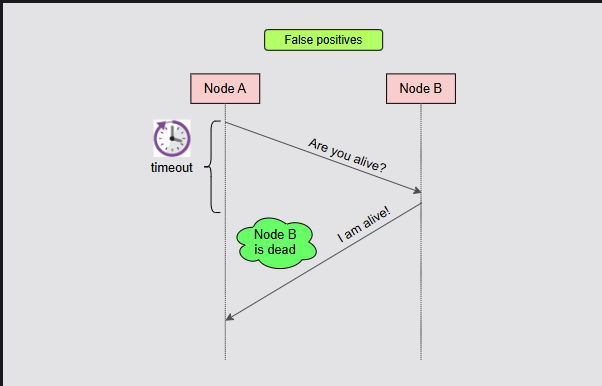

## Trade off for the larger timeout value

- A larger timeout means the system waits longer before deciding a node is unresponsive.
- This helps slow nodes avoid false crash detection but slows down recognizing actual failures, reducing system responsiveness and efficiency.
- For example, consider below diagram. Node A sends a request to Node B with a large timeout. Though node B has so much time to respond, when it responds, it might fail right after response and within that timeout. So Node A thinks its still alive but actual its crashed dead after responding to its request.
  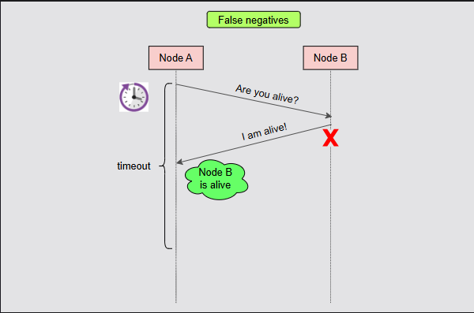

NOTE: Node A considers Node B alive because it received the response from Node B before the timeout and wouldn’t find that the node is crashed until the timeout duration completes

## Faliure Detector

A failure detector is a component of a node that we can use to identify other nodes that have failed. This component is essential for various algorithms that need to make progress in the presence of failures.

### Properties that categorize failure detectors

1. **Completeness** - percentage of crashed nodes a failure detector successfully identifies in a certain period
2. **Accuracy** - number of mistake a failure detector make in a certain period

### A perfect failure detector

Is the one with strongest form of completeness and accuracy. That is, it is one that successfully detects every faulty process without ever assuming a node has crashed before it actually does. As expected, it is impossible to build a perfect failure detector in purely asynchronous systems. Still, we can even use imperfect failure detectors to solve difficult problems. One such example is the problem of consensus.

# Stateless and Stateful Systems

## Stateless

A stateless system does not remember any previous interactions and processes each request independently using only the current inputs. A stateless system receives a set of numbers as input, calculates their maximum and returns its result.

These inputs are either direct or indirect.

1. Direct inputs are inputs that are included as part of request
2. While indirect inpputs are the inputs that are potentially received from other systems to fulfill the request

**Example:**

Imagine a service that calculates the price of a specific product by retrieving its initial price and any currenlty available discounts from some other services, and then performing the necessary calculations with this data. This service is stateless.
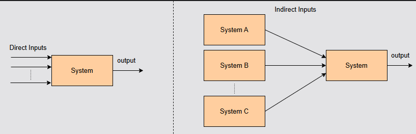

## Stateful

Stateful systems keep track of and change their internal data (state) over time. Their outputs rely on this stored information.

**Example:**

Imagine a system that stores the ages of all the employees of a company, and we can ask it the maximum age. This system is stateful since the result depends on the employees we register in it.

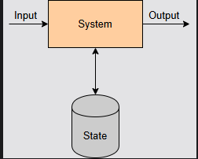

## Some interesting observations

- Stateful systems are beneficial in real life because computers are much more capable than humans of storing and processing data.
- Maintaining state involves additional complexity. For example, we must decide what’s the most efficient way to store and process it, how to perform back-ups, etc.
- As a result, it’s usually wise to create an architecture that contains clear boundaries between stateless components (which perform business capabilities) and stateful components (which handle data).

## Benefits of stateless systems over stateful systems

1. Stateless systems are much easier to design, build and scale compared to stateful ones
2. The main reason for this is that we consider all the nodes of stateless are identical. This makes it a lot easier for us to balance the traffic between them and scale by adding or removing servers
3. However, stateful systems present many more challenges as different nodes can hold different pieces of data, they require additional work. They need to direct traffic to the right place and ensure each instance is in sync with others

# Partitioning

Patitioning means, splitting of data across multiple machines (servers) instead of storing everything in one machine. Each server stores a portion of data. This portion is called **partition or shard**

## Why do we need partitioning ?

Imagine you are building instagram. If you store all users, like, posts etc in just 1 database server, problems occur:

1. Database becomes slow
2. Storage fills up
3. Too many requests could crash the server

Solution ? Split the data across multiple servers

```
Instead of

Server 1
--------
All Users
All Posts
All Comments

We do

Server 1          Server 2          Server 3
---------         ---------         ---------
Users A-F         Users G-M         Users N-Z
Posts A-F         Posts G-M         Posts N-Z
Comments A-F      Comments G-M      Comments N-Z
```

each server handles a part of data. This is partitioning

## Real world analogy

Think of a library. If we place all books in just one shelf, it becomes impossible to manage. So if the library splits books by category or alphabet, then finding books becomes fast and scalable. This is exactly what partitioning does in distributed systems.

```
Shelf 1 → A - F
Shelf 2 → G - M
Shelf 3 → N - Z
Shelf 4 → Others
```

## Another example

Imagine we have 100 million users

**Without partitioning**

```
             +----------------+
Users -----> |  Single DB     |
             | 100M users     |
             +----------------+

Problems
- slow queries
- server overload
- scaling impossible
```

**With partitioning**

```
              +-----------+
Users A-F --->| Server 1  |
              +-----------+

              +-----------+
Users G-M --->| Server 2  |
              +-----------+

              +-----------+
Users N-Z --->| Server 3  |
              +-----------+

Now:

- load is distributed
- system is scalable
- faster queries
```

## Types of partitioning

### Range Partitioning

Here data is split by ranges

```
Server 1 → Users 1 - 1M
Server 2 → Users 1M - 2M
Server 3 → Users 2M - 3M
```

**Problem:**

If most traffic hits one range, that server becomes overloaded.

### Hash Partitioning

Very popular in modern systems. We use a hash function like below

`hash(key) % number_of_servers`

**Example:**

`hash(userId) % 3`

**Advantages:**

1. even distribution
2. avoids hotspots

**Disadvantage**

- Range queries involve retrieving data within a specific range of values. In hash partitioning, because data is distributed based on a hash function rather than sorted order, it’s not possible to efficiently perform range queries on the partition key without extra data or querying every node. This limitation arises because the hash function scatters related values across nodes, preventing direct range access.
- Adding or removing nodes from the system causes it to repartition. This results in significant data movement across all nodes of the system

**Used in:**

1. Cassandra
2. DynamoDB
3. Kafka

### Consistent hashing

Consistent hashing is similar to that of hash partitioning except that in this we assign a random integer to every node in range of [0, L]. This is called **ring**(for example [0, 360]). Then the system uses a column value as a partitioning key to locating the node after the value we get when hash function is applied (`hash(s) mod L`) in the ring.

- Assume we have a key, value, hash columns (where hash is `hash(value) mod 360`)
- Then in the circle where all nodes are present, depending on the hash value we get, we push the key's to next node which has greater value of assigned integer comparing to the hash value we get. For example, in below screenshot, key_1 has a hash value 246. The integer assigned to node 3 is 289 which is greater than 246, so we push that key_1 data to that node

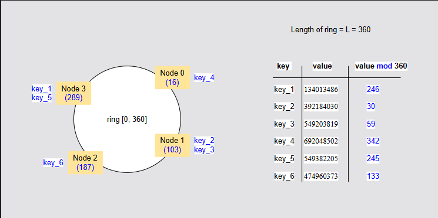

- As a result, when a node is removed, the data will be moved to next node in the ring like below, where Node 3 is removed so the key_1 and key_5 is migrated to Node 0


- When a node is added, the data from the next node will be moved to the newly added node depending on the integer assigned to the newly added node and the hash value's of the keys present in the next node (if it falls under the newly added node integer value, like the hash value of the keys which are present in the next node to newly added node is less than that of integer given to the newly added node)

**Before**

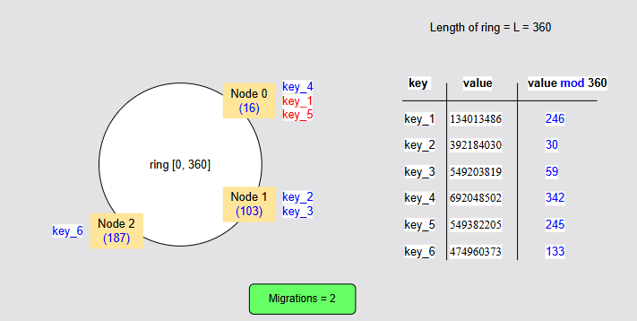

**After**

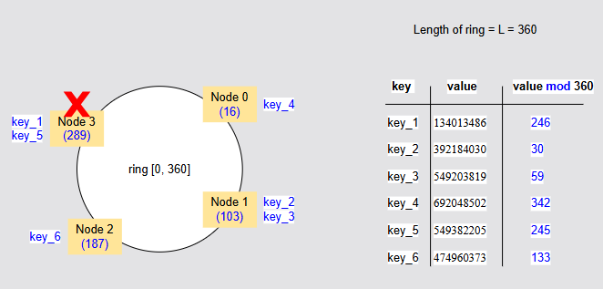

- Here, the Node 3 is added and has 289 integer assigned to it
- As the hash value of key_1 and key_5 are 246 and 245 and both are less than 289, they(both keys) are moved to Node 3

**Advantage**

Consistent hashing has one main advantage, when compared to hash partitioning:

- Reduced data movement when nodes are added or removed in the system

**Disadvantage**

- The potential for the data’s nonuniform distribution because of the random assignment of nodes in the ring
- The potential for more imbalanced data distribution as nodes are added or removed. E.g., a node’s dataset is not distributed evenly across the system when it is removed but is instead transferred to a single node

### Directory Based Partitioning

A lookup table tells where the data is stored

```
        +-------------+
Request → Directory   |
        | Lookup      |
        +-------------+
              |
              v
         Correct Server
```

## Where its used in real systems

Very common in large scale systems.

**Examples:**

**Databases**

- MongoDB sharding
- Cassandra
- DynamoDB
- MySQL sharding

**Messaging systems**

Kafka partitions

**Caching**

Redis cluster

**Search systems**

Elasticsearch

## Advantages

1. **Scalability** - Add more servers, system grows easily
2. **Faster Queries** - Only one database server (shard) is queried, not all servers
3. **Load Distribution** - Traffic distributed across machines

## Challenges of Partitioning

**1. Data Skew**

Some servers get more traffic -> Bad partitioning

```
Server1 → 10M users
Server2 → 1M users
Server3 → 500k users
```

**2. Rebalancing**

You have servers

```
Server1
Server2
Server3
```

Now you want to add `server 4`

Data must be moved between servers. This is rebalancing.

**3. Cross Partition Queries**

Suppose the users data is partitioned so it is now in 4 servers. Running below query must hit all the servers or shards. So it will be slow

`SELECT * FROM users WHERE age > 20`

## Variations of partitioning

There are two major variations that are always discussed in distributed systems.

### 1. Horizontal Partitioning

This is the most common partitioning in distributed systems. It means, The rows of a table are split across multiple servers

```
Users Table

UserID | Name | Country
------------------------
1      | John | USA
2      | Ravi | India
3      | Chen | China
4      | Sara | UK
5      | Alex | USA
```

```
             Users Table
                  |
        -------------------------
        |           |           |
     Server1     Server2     Server3
     Users1-2    Users3-4    Users5
```

Each server has different rows.

**Disadvantage**

- In a horizontally partitioned system, we can usually avoid accessing data from multiple nodes because all the data for each row is located in the same node. However, we may still need to access data from multiple nodes for requests that are searching for a range of rows that belong to multiple nodes.(Like is 100 users are in one server and 100-200 are in other, what if the query is to get users between 80-120 ? have to call 2 servers)
- Another important implication of horizontal partitioning is the potential for loss of transactional semantics.When we store data in a single machine, we can easily perform multiple operations in an atomic way, where either all or none of them succeed. However, this is much harder to achieve in a distributed system. Transactional semantics refer to the guarantee that multiple operations either all succeed or all fail together (atomicity). In a single machine, this is easy to ensure, but in horizontal partitioning across multiple nodes, achieving atomic operations is difficult because data is distributed, making coordinated transactions complex.

### 2. Vertical Partitioning

Unline horizontal partitioning, vertical partitioning has its columns splited across multiple servers

**Instead of**

```
UserID | Name | Email | ProfilePic | Bio | Address
```

**Split into**

```
Server 1
--------
UserID
Name
Email

Server 2
--------
UserID
ProfilePic
Bio
Address
```

**Why do this?**

Because some columns are accessed more often. For example, login API only needs UserId, email, password. So we keep them in fast servers

**Disadvantage** - it requires joining data from multiple servers when we have to query from multiple servers. Additionally, keep in mind that while vertical partitioning helps with scalability and optimizing certain queries, it can introduce overhead for queries needing complete data

### 3. Hybrid Partitioning (need to understand better)

Many real systems combine both horizontal + vertical partitioning.

```
                 Users
                   |
        ------------------------
        |          |           |
      Shard1     Shard2      Shard3
        |          |           |
     --------    --------    --------
     Basic DB    Basic DB    Basic DB
     Media S3    Media S3    Media S3
```

### 4. Functional Partitioning

Its also called as service-based partitioning. Instead of splitting data, we split features. So each feature has its own database and Each service manages its own database. This is microservices architecture used by netflix, amazon etc

```
          System
             |
   --------------------------
   |        |       |       |
Users    Orders  Payments  Notifications
Service  Service  Service   Service
```

### 5. Geo Partitioning

Data is partitioned based on region.

US Users → US Datacenter

Europe Users → EU Datacenter

India Users → India Datacenter

**Advantages:**

- low latency
- compliance
- faster responses

# Replication

- Replication is a technique used in distributed systems to increase availability.
- It consists of storing the same data in multiple nodes(called replicas) so that if one fails, data is not lost and requests can be served from the other nodes in the meanwhile
- Availability refers to the ability of a system to remain funtional even when there are failures in parts of it

## Goals of replication

1. **High availability** - System continues working even if some servers fail.
2. **Fault tolerance** - System survives machine crashes, network failures, hardware failures.
3. **High read performance** - Many users can read from different servers.

## Algorithms used in replication

### Primary-backup replication

- It is a technique where we designate a single node from the replicas as a primary or leader node that receives the updates. It is also called as single-master replication.

- We commonly refer the rest of the replicas as followers or secondaries. These can only handle read requests.

- Everytime the leader receives an update, it executes it locally and also propagate the update to the other nodes. This ensures that the data is consistent across all nodes

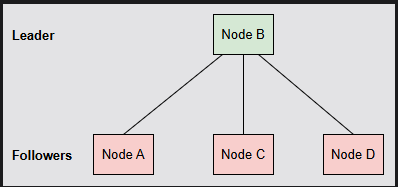

#### **Techniques for propogating updates**

There are two ways to propagate updates: synchronously & asynchronously

**1. Synchronous replication**

- In synchronous replication, the leader or primary node will wait for acknowledgment of its replicas to update in their local storage and then respond back to the client
- This will guarantee that the client will be able to the updated content from next read calls to any replicas or leader
- this provides durability because the updates would be lost even if leader is crashed after it acknowledges the update
- however, this technique can make writing requests slower as the leader has to wait for all the replicas respond

**2. Asynchronous replication**

- In asynchronous replication, the leader or primary node will not wait for the replicas to respond back and so it responds back as soon as leader completes the job
- This technique increases performance for write requests as the client no longer has to wait for the replicas to respond
- this comes at the cost of reduced consistency and decreased durability
- After a client receives response from leader for an update request, if the client tried to read data from one of replicas instead of leader, the client might read old stale data, this might happen when or if the leader request to replicas is not yet performed.
- More over, if the leader node crashes right after it send ack back to client, the data might never be updated in replicas and would be lost forever (This means if the main node (leader) confirms an update to the client but crashes before sending that update to other copies (replicas), the update won’t be saved elsewhere and will be lost. In asynchronous replication, since the leader doesn’t wait for replicas to confirm, such data loss can happen if the leader fails immediately after acknowledgment.)

#### Advantages

1. Easy to understand and implement
2. Scalable for read-heavy workloads, because the capacity for reading requests can be increased by adding more read replicas

#### Disadvantages

1. Not much scalable for write-heavy workloads because the leader node capacity determines the capacity for writes
2. It imposes an obvious trade-off between performance, durability, and consistency
3. When you add more replicas for more read requests, the leader has to send updates to all these replicas. this increase the leaders outgoing network traffic. As a result, the leader becomes a bottleneck slowing down the update propogation and overall system performance

#### **Failover**

- Failover is when the leader crashes and a replica takes over
- there are two approaches to perform a failover: **manual** and **automated**
- manual is when the operator selects the new leader node and instructs all nodes accordingly. This is the safest approach but it will increase the downtime
- automated is when the replicas detect the crash of leader node via periodic heartbeats and attempt to elect a new leader node. this is faster but risky as there are many ways in which nodes can get confused and arrive at an incorrect state

### Multi-Primary Replication Algorithm or multi-master replication

- In this technique, all replicas will accept write requests and are responsible to propagate that updates to other replicas
- this gives higher availability and performance over data consistency
- In this technique, unlike primary backup replication algorithm, where the leader follows an order with replicas for write operations, this technique has no such leader so is no order and everything happens concurrently by all nodes.
- this cause something called conflict, depending on the latency of the propogation requests between the nodes of the system

**Example conflict**

1. Assume a Client and 3 nodes (A, B, C)
2. Client sends a request `x=10` to node A
3. Node A will wite to its local and propagates the same to Node B and C
4. Node C receives the value of X. However before Node B receives this, Client sends another write request to Node B (`x=14`)
5. Remeber that now the value `x=10` is written locally in both Node A and C but not in Node B
6. Now the Node B receives the new request `x=14` before the earlier write request of `x=10` from Node A
7. Node B writes `x=14` to its local and propagates the same to Node A and C
8. Node A and C receives the updated values for X and update the value of X locally to `x=14`
9. Now the Node B finally receives the first write request (`X=10`) from node A and it updates that value locally
10. The value of X at Node B is 10 while the other Nodes A and C contains value of X equals 14
11. Now, if client reads X , what will it get? Either 10 or 14 depending on which node serves the read request
12. This is conflict

#### **Conflict Resolution**

Conflict resolutions differ by the timings:

- **Eager resolution** - fixes the conflicts during the write operations
- **Lazy resolution** - it will allow multiple versions of write operations and resolves conflicts later during reads

**Some common approaches for resolution**

**1. Last-Write-Wins conflict resolution**

In this, each node in the system tags each version with a timestamp using a local clock. During conflict, the version with latest timestamp is selected and rest will be dumped.

This technique can lead to some unexpected behaviour as the local clock could be different for each node.

**Example:**

1. Assume user-a and user-b are trying to edit the same shared document
2. User-a makes changes in Server-a at 10:01am (according to its local clock)
3. User-b makes changes in Server-b at 10:00am (according to its local clock, which is slightly behind)
4. As both are trying to edit the same thing, when servers try to sync, there is a conflict and we start to use LWW for resolution
5. Now, actually the User-B update is the latest one as it comes after User-A update
6. But as this resolution considers the timestamp and it is different in these two nodes, the User-A will be selected
7. That is the drawback of this approach

**2. Exposing conflict resolution to the clients**

In this approach, we put both the versions that are conflicting to the client and client will decide which version to keep. This resolves the conflict

**3. Casuality tracking algorithm**

The system uses an algorithm that keeps track of causal relationships between different requests. When there is a conflict between two writes (A, B) and one is determined to be the cause of the other one (suppose A is the cause of B), then the resulting write (B) is retained.

However, there can still be writes that are not causally related, i.e., requests are actually concurrent. In such cases, the system cannot make an easy decision.

**Example**

Imagine two users, Alice and Bob, are editing a shared document stored in a distributed system with multi-primary replication.

Alice writes ‘Hello’ at 10:00 AM (Write A).
Bob, after seeing Alice’s change, adds ’ World’ at 10:01 AM (Write B).
Here, Bob’s write (B) is causally dependent on Alice’s write (A), because Bob saw Alice’s change before making his own. If there’s a conflict, the system can safely keep Bob’s version (‘Hello World’), since it already includes Alice’s change.

But if Alice and Bob both write at the same time, without seeing each other’s changes, their writes are concurrent. In that case, the system can’t tell which to keep based on causality alone.

# Quorums in distributed systems

Quorum means the minimum number of votes (nodes) required to perform an operation successfully.

Since we can't always trust the network (it's asynchronous and messy), we use Quorums to make sure that a majority of servers agree on a piece of data, preventing one "lone wolf" server from making a mistake

To understand Quorums, you just need to know three numbers:

1. $N$: Total number of nodes in the cluster.
2. $W$ (Write Quorum): How many nodes must confirm they saved the data before we tell the user "Success!"
3. $R$ (Read Quorum): How many nodes we must talk to when reading data to be sure we have the latest version.

**The golden rule: W + R > N**

To guarantee that you never read old or stale data, your write + read quorum should always be greater than total number of nodes. This ensures that atleast one of your node in your read group is also in write group

1. Assume we have 3 nodes
2. And we want atleast 2 successful writes before we can respond success to user and 2 successful reads before we can respond success to user
3. It means that, even if 2 writes are successfull out of 3, we have latest data available in 2 nodes. Lets assume those 2 nodes are Node 1 and Node 2
4. Now when user makes a read request and our quorum is 2, we check atleast 2 nodes out of 3 to respond to user
5. Let that 2 nodes be Node 2 and Node 3 or Node 1 and Node 3 or Node 1 and Node 2. If you observe, all these three possibilities have either Node 1 or Node 2, to which we have written new data in step 3
6. Which means that, Node 1 or Node 2 will respond with the latest data.
7. Remember that in here we take timestamp as the key to check the latest value and The write request is usually sent to all nodes, but the "Success" message is sent back to you the moment the minimum number ($W$) responds

**NEED TO UNDERSTAND Vw > V/2 rule**

# Safety guarantees in distributed systems

- Safety guarantees in DS are some formal rules that ensure a system never does anything bad. If a system has a safety guarantee, it means that even if the network is slow or server crash, the system will never reach an incorrect or corrupted state.
- Or in simple, A common way to remember this is: "Something bad will never happen."
- These guarantees will help us manage complexities like partial failures, network asynchrony and concurrency, enabling us to design more predictable and reliable distributed systems

## Properties that guarantees safety in distributed systems

### 1. Atomicity

Atomicity is a safety guarantee that ensures an operation happens completely or not at all. A partial failure occurs when some components in the system fail.

**Challenge:** It is challenging to achieve atomicity in a distributed system because of the possibility of partial failures.

### 2. Isolation

Isolation ensures that even if 1000 transactions are happening at the same time, they dont interfere with each other and each transction should feel like it is the only one running

**Challenge:** It is challenging to achieve isolation because of the inherent concurrency of distributed systems. Concurrency occurs when multiple things happen at the same time.

### 3. Consistency

**NOTE:** Consistency in here means, the database must always move from one valid state to another valid state. No rule violations. Example: Balance cannot be negative is a rule set by bank, Some user has a balance of 500 in their account and they try to withdraw 1000, rule should be followed and transaction should fail. So, database stays consistent

**Ignore below as far as this topic is concerned**

Consistency here refers to the property that all nodes in a distributed system have the same data at the same time.

**Challenge:** It is challenging to achieve this because of network asynchrony.
Network asynchrony refers to both lack of global clock and also unpredictable message delays.

example

Imagine a distributed database with two nodes, A and B. Suppose a user updates a record on node A. Because of network asynchrony, the update message from A to B is delayed. For a while, node A has the new value, but node B still has the old value. If another user reads from node B before the update arrives, they will see outdated data. This means the system is temporarily inconsistent because not all nodes have the same view of the data.

This example shows how network asynchrony (message delays) can make it hard to keep all nodes consistent.

# ACID Transactions

Refer to above for Atomicity, Consistency, Isolation

## Durability

It means that, data is never lost. Once a transcation is committed, it is permanently saved even if there is power failure, server crash, restart

# CAP Theorem

The CAP theorem states that distributed data systems can only provide two of three guarantees—Consistency, Availability, and Partition Tolerance—simultaneously. When network partitions (failures) occur.

## Consistency (C)

- Consistency here refers to the property that all nodes in a distributed system have the same data at the same time.
- Or we can say that all nodes return same latest data.
- If you write data to one server, every server must show that update immediately.

**Example**: balance = 1000, withdraw = 500, every server must show 500

**NOTE:** The concept of consistency in the CAP theorem is completely different from the concept of consistency in ACID transactions. The notion of consistency as presented in the CAP theorem is more important for distributed systems.

## Availability (A)

It refers to, Every request must receive a response even if some servers are broken. Response can be old data but the system must respond

**Example**: If a insta like count is 1000, but other server shows 999, thats ok, system should not fail, thats all

## Partition tolerance (P)

This property states that, system should keep working even if network between servers fail/break

**This is extremely important because networks fail all the time**

## Real meaning of CAP

Many beginners think we have to choose any 2 between C,A,P but the real meaning is, P is mandatory because network failure WILL happen. So the real choice becomes CP or AP not CA

## CP system

- This will guarantee consistency and partition tolerance
- If partition happens, system rejects requests instead of giving wrong data
- Assume client sends a write request to server A and as per consistency meaning, the data should be same in all the servers, but due to paritition the server A could not send the write request to server B
- As the data sync is lost, and consistency is failed, system rejects the requests instead of giving wrong data
- If partitions happens (network breaks) and if you must choose **Correct Data** over **Always Respond** then choose this

## AP system

- This will guarantee availability and partition tolerance
- This means, **System always responds** even if data is not in sync
- For example, user 1 likes a post, server A shows 101 likes and server B shows 100 likes. Eventually they will sync, but because we choose AP system, it will respond something instead of rejecting the like request. This is called eventual consistency (side note)

## CA system

- This cannot work in distributed system
- Because in a distributed system, network partition will happen for sure
- So CA only exist in single server database

## CHAT GPT QUCIK REFERENCE

# CAP Theorem – Quick Reference

## Core Idea

In a distributed system, during a network partition, you must choose between:

- Consistency (C)
- Availability (A)

You cannot guarantee all three: C, A, and Partition Tolerance (P)

---

## CAP Properties

| Property                | Meaning                        | Simple Explanation                                  | Example                       |
| ----------------------- | ------------------------------ | --------------------------------------------------- | ----------------------------- |
| Consistency (C)         | Same data on all nodes         | Always get latest/correct data                      | Bank balance must be accurate |
| Availability (A)        | Always respond                 | System never fails to respond (may return old data) | Instagram likes count         |
| Partition Tolerance (P) | Works despite network failures | System continues even if nodes can't communicate    | Cloud systems                 |

---

## Reality Rule (IMPORTANT)

- Partition (P) is **mandatory** in real distributed systems
- So actual choice is:

👉 **CP OR AP (NOT CA)**

---

## System Types

| Type | Guarantees                         | Sacrifice           | Meaning                          | Real-world Analogy       |
| ---- | ---------------------------------- | ------------------- | -------------------------------- | ------------------------ |
| CP   | Consistency + Partition Tolerance  | Availability        | Correct data > Always respond    | Bank system              |
| AP   | Availability + Partition Tolerance | Consistency         | Always respond > Correct data    | Instagram / Social media |
| CA   | Consistency + Availability         | Partition Tolerance | Works only if no network failure | Single server DB         |

---

## Easy Memory Trick

| Concept | Meaning          |
| ------- | ---------------- |
| CP      | "Correct data"   |
| AP      | "Always respond" |

---

## Real World Examples

| System               | Type        | Why                                 |
| -------------------- | ----------- | ----------------------------------- |
| Banking system       | CP          | Cannot show wrong balance           |
| Instagram / Facebook | AP          | Can tolerate slightly outdated data |
| Uber (rides)         | AP (mostly) | Better to respond than fail         |
| MongoDB              | CP          | Prefers consistency                 |
| Cassandra            | AP          | Prefers availability                |

---

## Network Partition (IMPORTANT)

A partition means:

- Servers cannot communicate with each other

Example:

Server A ----X---- Server B

Now system must choose:

- Reject request (CP)
- Return possibly stale data (AP)

---

## Behavior During Partition

| Scenario      | CP System         | AP System          |
| ------------- | ----------------- | ------------------ |
| Write request | ❌ Reject         | ✅ Accept          |
| Read request  | ❌ May fail       | ✅ Always respond  |
| Data accuracy | ✅ Always correct | ❌ May be outdated |

---

## Bank vs Instagram Example

| Scenario         | Bank (CP)         | Instagram (AP)  |
| ---------------- | ----------------- | --------------- |
| Network failure  | Block transaction | Still show feed |
| Data correctness | Strict            | Flexible        |
| User experience  | May fail request  | Always responds |

---

## Key Interview Points

- CAP applies **only during network partition**
- Without partition, system can have both C and A
- CA systems are **not possible in real distributed environments**
- CAP is about **trade-offs during failures**

---

## Common Mistakes

❌ Thinking you can choose any 2 (C, A, P)  
✅ Correct: P is mandatory → choose between C and A

❌ Thinking CAP applies always  
✅ Correct: Only during partition

---

## One Line Summary

"During network failure, you must choose between correct data (Consistency) or always responding (Availability)"

---

## Must-Know Follow-up Topics

- Strong vs Eventual Consistency
- Quorum (R/W quorum)
- Leader Election
- Consensus Algorithms (Raft, Paxos)
- PACELC Theorem

# PACELC theorem (pronounced "pass-elk")

- CAP theorem talks about what happens where there is network failures (partitioning)
- PACELC theorem talks about both with and without network failures
- Because, even when there is no partitioning, the system still makes trade-offs:
  - faster response OR
  - more consistent data
- That’s where PACELC theorem comes in.

PASELC theorem says that

- If **partition happens**, choose between **availability** and **consistency**
- If **partition not happens**, choose between **latency** and **consistency**

Simplified meanings

- During failure → CAP applies
- During normal operation → Latency vs Consistency tradeoff

```
P  → Partition
A  → Availability
C  → Consistency

E  → Else (no partition)
L  → Latency
C  → Consistency
```

## Breaking down PACELC

### Part-1: P -> A or C

When network fails, choose Availability or consistency. We already learned this in CAP theorem

### Part-2: E -> L or C

When network is normal, choose betweek latency or consistency tradeoffs.
Choose:

- Low Latency (fast response) (latency is the response time)
- Strong Consistency (accurate data)

## Why latency vs consistency tradeoff happens ?

- To maintain consistency, data must be sync across all servers before responding, which takes time, so high latency
- To achieve less latency, we need to respond quickly from nearest server and that server data might be slightly outdated

## Example

Instagram has its servers in India, US, Europe etc:

### Option 1: To maintain strong consistency

Wait for all servers to sync likes/comments and respond - results in slow response (high latency)

### Option 2: To maintain low latency

Show data from nearest server, but may be slightly outdated

## Types of PACELC

1. PA/EC
2. PC/EC (Most common)
3. PA/EL (Most common)
4. PC/EL

### 1. PA/EL (Availability + Low Latency)

- When partition occurs -> choose availability
- When no partition -> choose low latency
- Means, always respond, always fast, may sacrifice
- Most real systems use this as user experience matters

### 2. PC/EC (Consistency + Consistency)

- When partition occurs -> choose Consistency
- When no partition -> choose Consistency
- Means, always correct data, will sacrifice speed
- financial systems use this as correct data matters

# Consistency Models

As we know consistency means everyone sees the same data when they try to access data from any replica out of all replicas available.

A consistency model defines what value a user see's when they read data. The key concept of consistency model is to answer **"When data changes, how fast does everyone see the same updated value?"**

## Types of consistency models

1. Strong consistency
2. Eventual consistency
3. Casual consistency
4. Read-Your_writes consistency
5. Monotonic Reads
6. Monotonic writes
7. Weak consistency

### **1. Strong consistency**

After a write, all read requests returns the latest value

or

We can say "Strong consistency ensures linearizability — every read reflects the most recent write."

**Pros**

- Accurate
- No confusion

**Cons**

- slow (all replicas need to sync)
- not scalable

### **2. Eventual consistency**

Data will be consistent, but after some time.
Example, Insta likes. Some users see it immediatly and some others see's it after 2-5 seconds

**pros**

- Fast
- Highly scalable

**cons**

- Temporary inconsistency

### **3. Casual consistency**

Related operations are seen in order and any unrelated operations might be seen in different orders

**Example:** Sending Hello and then how are you in whatsapp. We should see them in the same order as it was sent. Here hello and how are you are related operations.

```
User sends A → then B

System guarantees:
All users see A before B
```

**pros**

- preserves logical order

**cons**

- complex to implement

### **4. Read-Your-Writes Consistency**

You always see your own latest write

**Example:**

You update profile pic:

- You should see new pic immediately
- Others may see old pic

### **5. Monotonic Reads**

Once we see new data, we will never see older data again

News app:

- You read latest news
- Next refresh should not show old version

### **6. Monotonic Writes**

Writes happen in order and System ensures same order everywhere

`Write1 → Write2 → Write3`

### **7. Weak consistency**

No guarantees when data updates

### **7.1 Sequential consistency**

- Sequential consistency is a weak consistency model
- Sequential consistency means that while operations might not appear in the exact real-time order across all clients, everyone will agree on one single order for all operations. The key is that each person’s own entries in the logbook will always appear in the order they wrote them.

For example, imagine two friends, Alice and Bob, are updating their social media profiles.

Alice posts: “Hello!” then “Having lunch.”

Bob posts: “Hi there!” then “Great weather.”

With sequential consistency, all users might see the operations in an order like this:

1. Bob posts: “Hi there!”
2. Alice posts: “Hello!”
3. Bob posts: “Great weather.”
4. Alice posts: “Having lunch.”

Notice that Bob’s second post appears before Alice’s second post, even though Alice’s second post might have been written later in real-time. However, Alice’s posts are still in her original order (“Hello!” then “Having lunch.”), and Bob’s posts are also in his original order (“Hi there!” then “Great weather.”). All users see this same interleaved order. This is different from linearizability, where operations would appear to happen instantaneously and in strict real-time order.

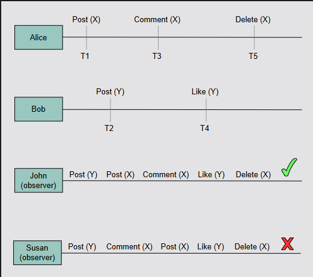

John is an observer who receives the events in a sequentially consistent order. John receives event T2 before T1 while T1 occured before T2 however, time is not important in sequential consistency, order of individual events is important. T1 must be received before T3.

# Isolation levels and anomalies

In distributed systems or databases, many transactions run at the same time. They may interfere with each other. For example, you are transferring money and someone else is checking balance at the same time. This will cause wierd bugs called **anomalies**

**Anomalies:** Unexpected wrong results due to concurrent transactions
**Isolation levels:** some sort of formal models that defines how much protection you get from anomalies or in simple, Rules that prevent anomalies

## Anomalies

```
Read Problems:
-------------
Dirty Read        → uncommitted data
Non-repeatable    → value changed
Phantom           → rows changed
Read Skew         → inconsistent snapshot

Write Problems:
--------------
Dirty Write       → overwrite uncommitted
Lost Update       → overwrite committed
Write Skew        → rule violation
```

### 1. Dirty writes

A dirty write occurs when a transaction overwrites a value that was previously written by another transaction that is still in flight and has not been commited yet.

One reason dirty writes are problematic is they can violate **Integrity constraints**

**Example:**

Two transactions

1. T1 -> writes x=1, y=1
2. T2 -> writes x=2, y=2

3. T1 writes x=1 but didnt commit yet
4. T2 writes x=2, y=2 (dirty write) and commits it
5. T1 writes y=1 and commit it
6. Now, in db, x=2, y=1. This is dirty write.

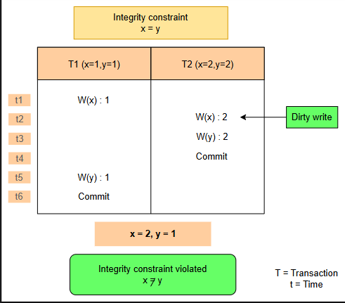

### 2. Dirty reads

A dirty read occurs when a transaction reads a value that was previously written by another transaction that has not yet been committed.

**Example:**
Transaction T1 updates salary → not committed yet
Transaction T2 reads that salary

Then T1 rolls back

👉 T2 read fake datab

```
T1: Write Salary = 1000 (not committed)
T2: Read Salary = 1000  ❌ (dirty read)
T1: Rollback → Salary back to 500
👉 T2 saw wrong value
```

### 3. (Fuzzy) non-repeatable reads

This occurs when a value is retrived twice during a same transaction and the value is different. This happens when another transaction updates(and commits) that value in between these two queries made to read data.

```
T1: Read balance = 500
T2: Update balance = 800 + commit
T1: Read balance again = 800 ❌
T1 expected same value, but changed
```

### 4. Phantom reads

A phantom read occurs in a database when a transaction reads a set of rows that satisfy a certain condition(predicate), but before is completes it, another transaction inserts or updates or deletes rows that also satisfy that same condition. As a result, if the first transaction re-issues the same query, it sees a different set of rows.

### 5. Lost updates

A lost updates occurs when two transactions read the same value and then they try to update it to two different values. Making the last updated transaction to overwrite the 1st transcation

```
Initial balance = 100

T1: Read 100
T2: Read 100

T1: Write 150
T2: Write 200 ❌ (overwrites T1)

👉 Final = 200 (T1 update lost)
```

### 6. Read skew

Read skew is a database anomaly that occurs when a transaction reads inconsistent data because another transaction commits its changes between first and second read queries.

**Example**

- Step 1: Transaction A reads row X
- Step 2: Transaction B updates both row X
  and row Y, then commits.
- Step 3: Transaction A reads row Y
- The Result: Transaction A sees the old version of X
  but the new, updated version of Y. This creates a "skewed" or inconsistent view of the overall system state, even though each individual row was read correctly.

### 7. Write skew

Write skew is a database anomaly where, below happens:

1. Two transactions read same data
2. Make decisions
3. Writes to different rows
4. Result -> constraint violated (means rule violated)

**Example**

Rule: Atleast 1 doctor should be on duty
NOTE: Both T1 and T2 happens concurrently

T1 -> reads Doctor A and B are on duty from database -> updates Doctor B database row to leave from duty
T2 -> reads Doctor A and B are on duty from database -> updates Doctor A database row to leave from duty

```
// Initial:
Doctor A = ON
Doctor B = ON

// T1
const A = await Doctor.findOne({ name: "A" });
const B = await Doctor.findOne({ name: "B" });

if (B.status === "ON") {
  await Doctor.updateOne({ name: "A" }, { status: "OFF" });
}

// T2 (same time)
const A2 = await Doctor.findOne({ name: "A" });
const B2 = await Doctor.findOne({ name: "B" });

if (A2.status === "ON") {
  await Doctor.updateOne({ name: "B" }, { status: "OFF" });
}


T1: sees B = ON → turns A OFF
T2: sees A = ON → turns B OFF

Final:
A = OFF
B = OFF ❌ (rule broken)
```

**Note:**

1. This skew happens in snapshot isolation (mongodb, postgreSQL)
2. This is why serializable isolation exists

**Fix:**

1. Serializable isolation
2. Add constraints (DB-level)
3. Use locking

# Prevention of anomalies in Isolation Levels

There is only one isolation level that prevents all the anomalies discussed above: **the serializable isolation**

Below are the 4 standard isolation levels.

```
More Isolation ↑  →  Less anomalies ✅  →  Slower performance ❌
Less Isolation ↓  →  More anomalies ❌ →  Faster performance ✅
```

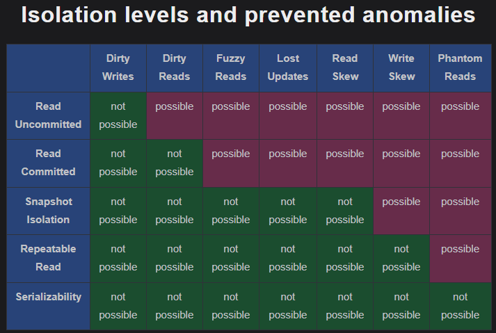

## 1. Read uncommitted (Worst)

This is the lowest level of isolation where a trasaction can see uncommitted changes made by other transactions. This can result in dirty reads, non-repeatable reads and phantom reads.

Dirty write might not be possible with this isolation as it has nothing to read

## 2. Read committed

In this isolation level, a transaction can only see changes made by other committed transactions. Here dirty writes and reads might not be possible as there is no scope of having uncommited data. But everything else (fuzzy reads, lost updates, read skew, write skew, phantom reads) are possible

## 3. Repeatable read

This isolation level guarantees that a transaction will see the same data throughout its duration even if other transactions commit changes to the data.

Note: The Repeatable Read isolation level protects against dirty reads by ensuring that a transaction only reads data that was committed before the transaction began, completely ignoring any uncommitted, intermediate changes made by concurrent transactions.

## 4. Serializability

In serializability, a transaction is executed as if it is the only transaction in system. Making multiple transactions execute one after the other. This will ensure no anomalies are present.

# Advanced isolation level

## Snapshot isolation model

Each transaction sees a consistent snapshot of the database at the start of the transaction. This model often use MVCC (multiversion concurrency control) mechanism. This mechanism stores multiple versions of data items simultaneously to allow concurrent access.

In snapshot isolation, Even if others update, you see same old data

# Differences between consistency models & isolation levels

## Consistency models

- defines how the data is synchronised across the distributed systems.
- concern -> "Data correctness accross the nodes"
- problems -> stale data, eventual mismatch, ordering issues etc
- controlled by -> strong consistency, eventual consistency, casual consistency, sequential consistency

example

```
User updates profile on Server A

User reads from Server B

Question:
Will B show updated data?

👉 Consistency decides this
```

## Isolation levels

- controlls how concurrent transactions behave in a database
- concern -> "concurrency inside database"
- problems -> dirty read, dirty write, write skew, read skew etc
- controlled by -> read commited, serializable etc

example

```
T1: updates balance = 1000
T2: reads balance

Question:
Should T2 see 1000 or old value?

👉 Isolation decides this
```

# Distributed Transactions

A distributed transaction is a transaction that happens across multiple systems/services/databases but still needs to follow ACID properties.

## Guarantees provided by database transactions

### 1. Atomicity

This property guarantees that either all of the operations in a transaction complete successfully or none of them take effect

### 2. Consistency

This property guarantees that a transaction will transition from one valid state to another valid state while maintaining all the invariants that the application defines.

As an example, a financial application defines an invariant that states that the balance of every account should always be positive. The database then ensures that this invariant is maintained at all times while executing transactions.

### 3. Isolation

This guarantees that transactions are executed concurrently without interfering with each other.

### 4. Durability

Durability guarantees that once a transaction is commited, it remanins committed even in case of a system failure (for example power outage)

# Serializability vs Strict Serializability

- In serializability, the end result should be same as if transactions ran one by one. Order doesnt matter here.
- In Strict Serializabilitt, the end result should be same as if tranasactions ran one by one but follows real-time order

**Example**

```
Think of ATM transactions

Case 1: Serializability

T1 (10:00 AM): Withdraw ₹100
T2 (10:01 AM): Check balance

System shows

Balance = 1000

👉 This is possible in serializability
(because system can reorder transactions internally)


Case 2: Strict Serializability

T1 happens BEFORE T2 in real life
T2 MUST see result of T1

👉 Balance = 900 ✅
```

# Achieving Serializability

## Schedule

A schedule is the order in which operations (read/write) of multiple transactions are executed.

When you have multiple transactions like below and when they run together, operations of these transactions get mixed up. That mixed order is called "Schedule"

T1 -> Read(A), Write(A)
T2 -> Read(A), Write(A)

example schedule

```
S1:
T1: Read(A)
T2: Read(A)
T1: Write(A)
T2: Write(A)

👉 This is a schedule
```

## Types of serializability

### 1. Conflict Serializability

If conflicting operations follow a consistent order without cycles, then the schedule is conflict serializable

`Different transactions + atleast 1 write + same data = conflict`

**Example 1:**

```
S:
T1: Write(A)
T2: Write(A)
T1: Write(B)
T2: Write(B)
```

**Conflicts:**

- A -> T1 -> T2
- B -> T1 -> T2

**Graph:**

T1 -> T2

No cycle, hence serializable

**Example 2:**

```
S:
T1: Write(A)
T2: Write(A)
T2: Write(B)
T1: Write(B)
```

**Conflicts:**

A -> T1 -> T2
B -> T2 -> T1

**Graph:**

T1 -> T2
T2 -> T1

cycle, hence not serializable

### 2. View Serializability

# QA

## 1. What is clock and global clock ?

Clock is just something that will tell us the time and global clock is a shared clock that everyone agrees

```
Clock
Laptop clock   → 10:00:05
Server clock   → 10:00:08
Phone clock    → 10:00:02
📌 Each machine has its own clock.

GLOBAL CLOCK
      |
      |---- Machine A → 10:00:00
      |---- Machine B → 10:00:00
      |---- Machine C → 10:00:00
📌 Everyone sees the same time at the same moment.

```

Example:

```
Server A (India)
Clock: 10:00:00

Server B (US)
Clock: 09:59:55
```

Now:

- Server A sends a message at 10:00:01
- Server B receives it at 09:59:59

😵‍💫 According to clocks:

- Message arrived BEFORE it was sent!
- This is clock skew.

Why this happens

- Different hardware
- Network delays
- Clock drift
- Sync delays (NTP is not perfect)

📌 Perfect sync is impossible

## 2. Does your system support exactly-once?

We use at-least-once delivery with idempotent handlers, request IDs, and database transactions to achieve exactly-once effect. As True exactly-once is almost impossible in distributed systems.

## 3. Why exactly-once is almost impossible in distributed systems ?

## 4. What is exactly-once semantics?

A: Exactly-once semantics guarantees that an operation is executed only once, even in the presence of retries, failures, or network issues.

## 5. Is exactly-once truly achievable?

A: True exactly-once is extremely difficult in distributed systems. Most systems achieve exactly-once effect using idempotency, deduplication, and transactions.

## 6. How do payment systems avoid double charging?

A: By using idempotency keys, request IDs, and database transactions to ensure duplicate requests are ignored.

## 7. How does Kafka support exactly-once?

A: Kafka uses producer IDs, sequence numbers, and transactional writes to ensure messages are produced and consumed exactly once within Kafka.

## 8. Difference between at-least-once and exactly-once?

A: At-least-once may process duplicates, while exactly-once ensures duplicates do not affect the final result.

## 9. What are the nature of networks in distributed systems ?

In distributed systems, nature of network refers to "How long will it take for my message to get there?". There are two types of networks:

**1. Synchronous Networks**

In this, there is a strict upper bound on how long things take. So we have a guarantee on maximum delay, making it predictable timing.

- Predictable Timing: You know that a message will arrive in, for example, no more than 5ms.

- Synchronized Clocks: Every computer on the network agrees on the exact time.

- Easy Failure Detection: If you don't hear back in 5.1ms, you know with 100% certainty that the other server crashed or the wire was cut.

**2. Asynchronous Networks**

In an asynchronous network, there are no time guarantees. A message could arrive in 1ms, 1 minute, or 1 day.

- Variable Delay: The network can be congested, a router could reboot, or a cable could be slightly flaky.

- Independent Clocks: Each computer has its own clock, and they often "drift" apart (one might be 2 seconds faster than the other).

- Impossible Failure Detection: If you don't hear back, you have no way of knowing if the other server is dead or if the network is just being extremely slow today.
